# Height Map Displacement with Satellite Imagery

- [Mostly Based on this](https://www.youtube.com/watch?v=Yc8xJcwNRGk&t=621s&ab_channel=KevBinge)

- The results: 
  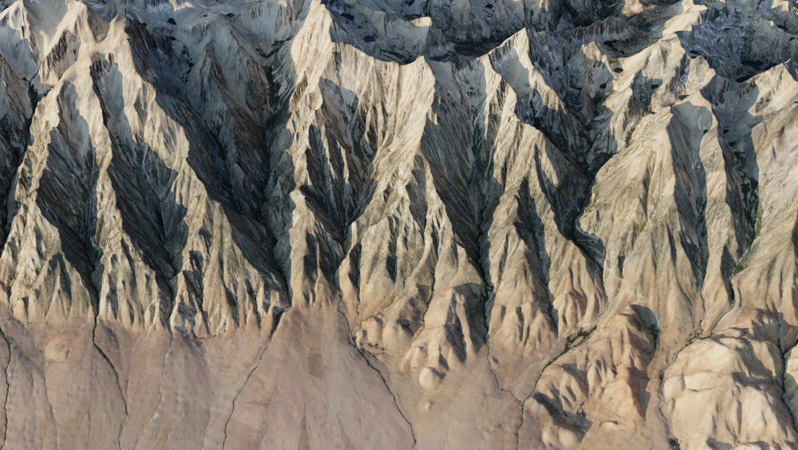

- Go to [Terrain Party](https://terrain.party/), find some exciting terrain, and export it (it's really pretty self-explanatory)
   - Note that [Tangram Heightmapper](https://tangrams.github.io/heightmapper/) creates pixelated terrain, which is a very neat stylistic effect, but not what I'm after. 
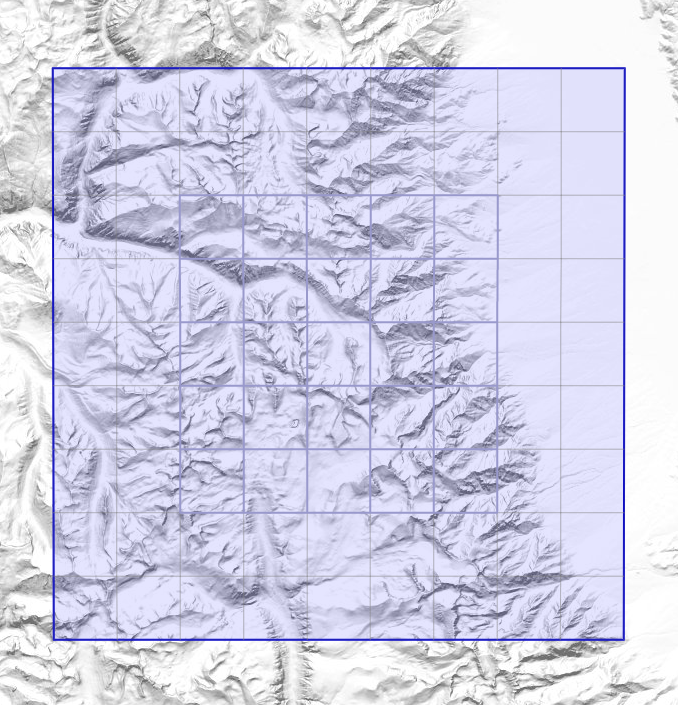
  This is off in California East of Fresno somewhere. 

- Unzip the folder from Terrain Party and open the `README`. Look for a line like this at the top:  
    ```
    http://terrain.party/api/export?name=EastOfFresno&box=-118.174644,36.874371,-118.567680,36.559962
    ```
    We're particularly interested in that string of numbers after the equals sign, which are the coordinates of the NE-SW diagonal of the square region from Terrain party. Assign the coordinates compass directions in the order `(East,North,West,South)`, for example for my region's coordinates
    ```
    (East,North,West,South)=(-118.174644,36.874371,-118.567680,36.559962)
    ```        
- Download this image (or make your own)

  
  
- Download, install, and open [Google Earth Pro](https://www.google.com/earth/versions/#earth-pro) for desktop. 

- Ignore the heinous UI. 

- Zoom in on our region by searching for any one of those coordinates we have written down, doesn't matter which:
  

- Clear the search (press the `blue X` at the bottom left of the search tab), and then select `Add Image Overly` from the toolbar at the top. 
  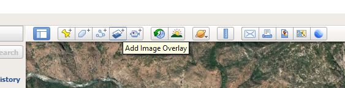

- It opens up a UI box. Click the `Location` tab, and copy-paste those coordinates from earlier into their corresponding field (it will automatically convert them to Degree Minute Seconds), and fill the `Link` field in with that empty white square we downloaded earlier: 
  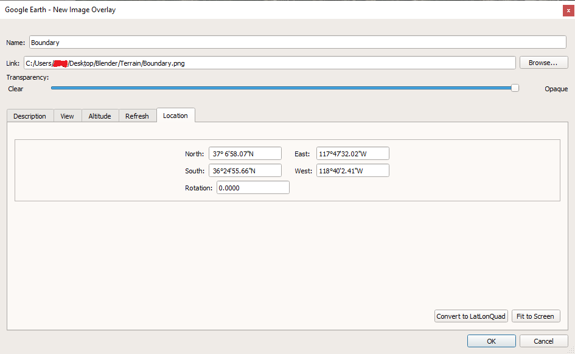

- Make sure the view is looking straight-down with North up by selecting `View->Reset->Tilt and Compass`
  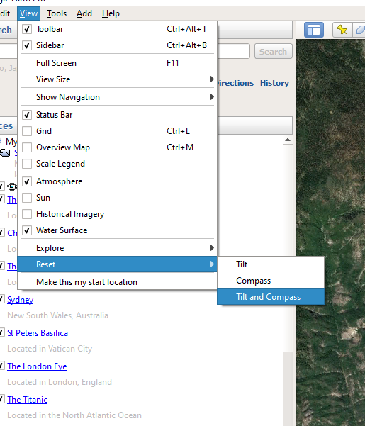

- You should have something like this


- Click `Print` on the toolbar 
  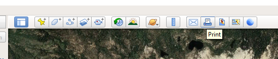

- Turn off any unnecessary garbage by toggling it in the `Map Options` dropdown 
  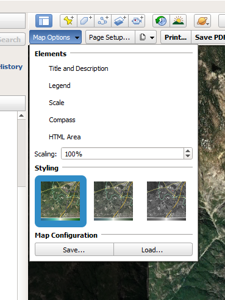

- Save a .pdf image of the region using `Print...` or `Save PDF...`. If you have [Adobe Acrobat](http://dylanbrowndesigns.com/tutorials/how-to-save-or-print-high-resolution-images-from-google-earth/#:~:text=Open%20Google%20Earth's%20print%20option,a%20PDF%20print%20driver%20installed.) or whatever, you can control the resolution of the section you are saving, I  think. I do not, but I found a workaround. 

- If you have photoshop, open the pdf with that and set the `dpi` to `600`. I think this extracts more resolution from the pdf. Or I'm full of shit, not sure which, to be honest. 
  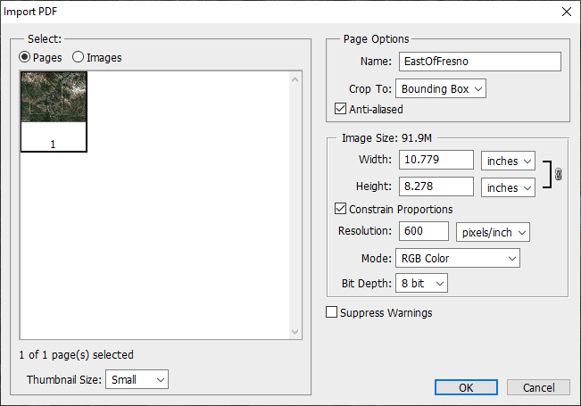

- Now crop the opened image to the boundary of the overlaid square, and save the image as a .png.
  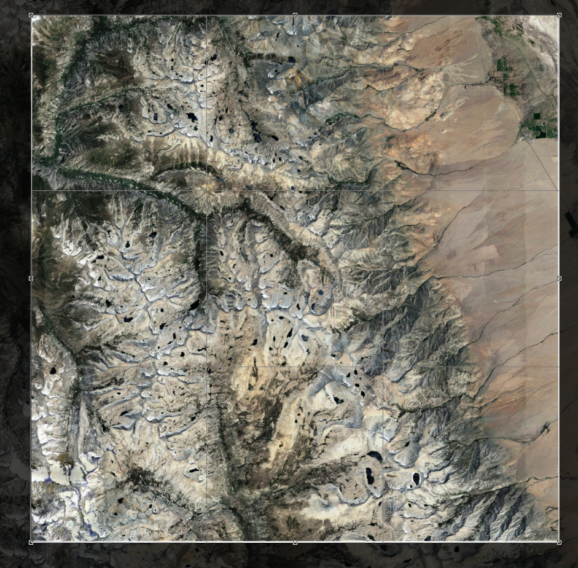
  Neat trick: if you hold `Alt` while scrolling in crop-mode, you can zoom in and actually see the goddamned boundary. 

- Open Blender. Enable experimental features under the renderer 
  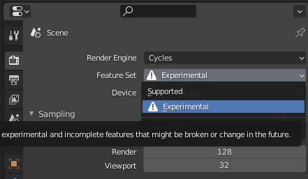  

- Create a plane, add a `Subdivision` modifier to it, set it to `Simple`, and check the `Adaptive Subdivision` checkbox. 
  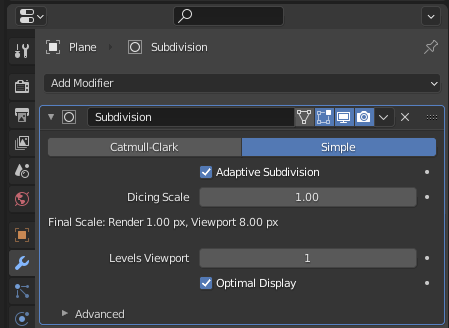

- Create a material for the plane, and under `Settings`, set `Displacement` to `Displacement Only`
  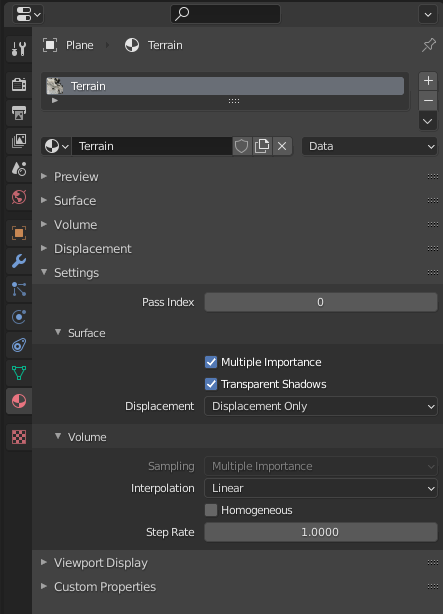

- Open the Shader editor, add a `Displacement` node, drag the png labelled `Merged` into it from the height maps downloaded from Terrain Party, and set the image node to `Cubic` interpolation and `Non-Color` mode; set the `Displacement` node scale to something reasonable. 
  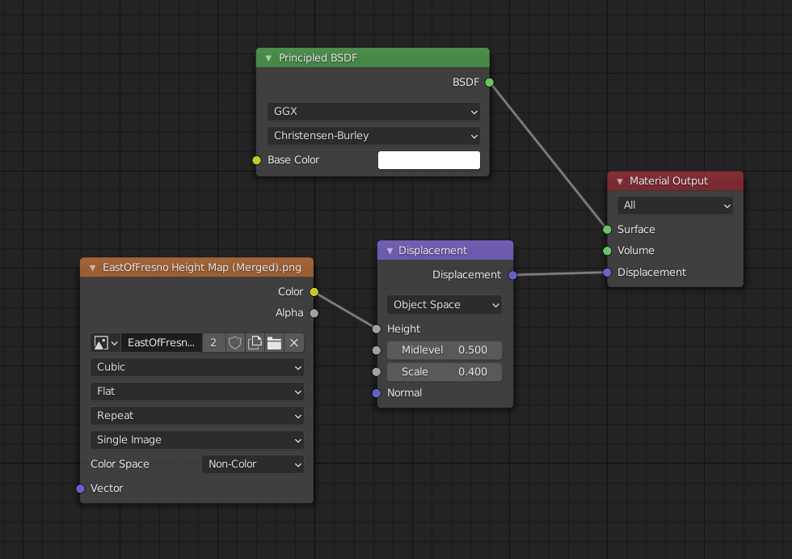
  Note that the `Cubic` interpolation mode smooths out the height map a bit (at the expense of a little detail)
  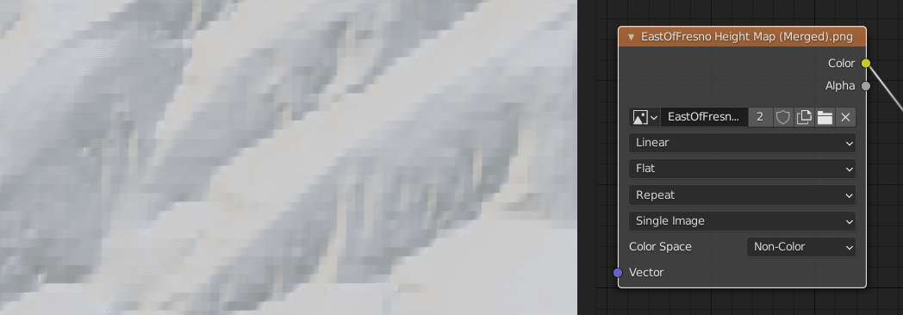
  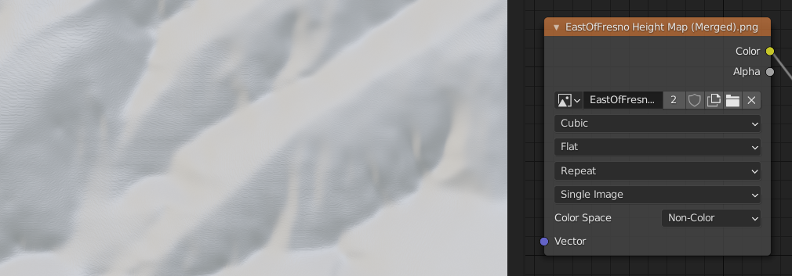

- Congrats! Now you have some terrain. Open the UV Editor and scale the unwrapped plane down just a touch so that it's within the height map's boundary. This fixes the vertical shearing at the edges.
  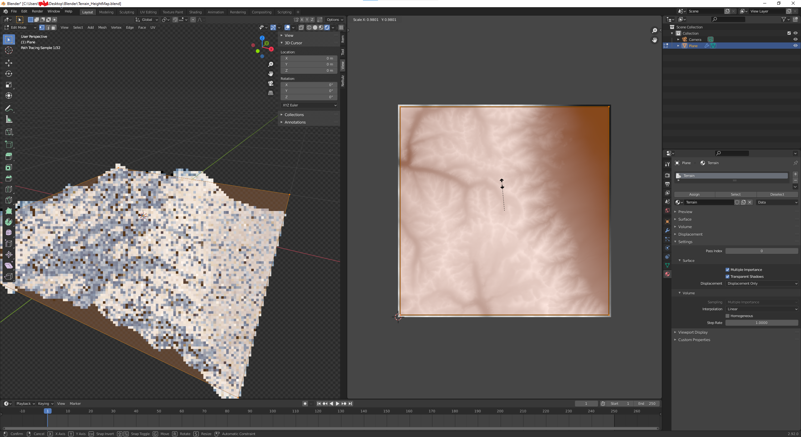

- Go back to the node editor, drag in the cropped terrain imagery, and pass it into the `Principled BSDF`'s `Base Color` input. 
  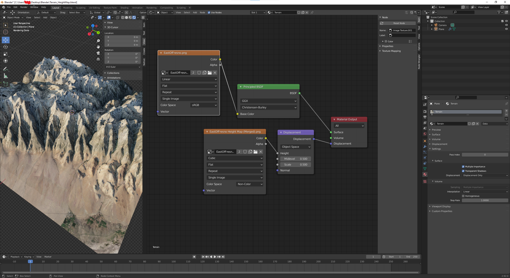

- And there you go, as far as this tutorial is concerned. The rest is up to you. Add an HDRI, or otherwise light things how you want, and go wild. 

- The results are kind of amazing 
  
  Still, probably best used at a reasonably distance. 

- Some final comments:
  - First of all, comments and criticisms are welcome. I'd *love* to hear from anyone who has ideas on how to improve on this approach. 
  - I think this process is probably best for background terrain. The way I'm doing things, the imagery is not high-resolution enough to be viewed too up-close. 
  - The height map alone, though, with procedural textures and some imagination, I believe could definitely be effectively used for up-close, highly-detailed terrain, but there are other tutorials on that, [e.g.](https://www.youtube.com/watch?v=f9OxD3qbSiM&ab_channel=RemingtonCreative).
  - ?
