# lsystems

## Outline 
What this is: 
- How to convert [Structure Synth "Eisenscripts (ES)"](http://structuresynth.sourceforge.net/reference.php) into Sverchock Generative Node-readable XML rulesets and demonstration. 
- Creating a tree-like structure using the Generative Node from a Structure Synth ES converted to XML, and doing some Sverchok "stuff" to it to get a useful assembly for doing artwork on (**image here, maybe**).
- Reference to an absolute goldmine of Structure Synth examples. 

What this is *not*:
- How to convert an arbitrary shape *into* a ruleset.
- I don't know how this is done, really, and I'm as confused as anyone looking at rulesets trying to figure out what they mean. `confused_julia_roberts.jpeg` 
- You can try to read [Algorithmic Beauty of Plants](http://algorithmicbotany.org/papers/abop/abop.pd), etc.; my current record is "still somewhere in the first chapter."
    
    I mean honestly, if anyone knows the secrets to happiness, it's clearly this man. 

If you stick around, I'll babble endlessly about: 
- My motivation, some of my other Sverchok work (that I'm hoping to pair with this), **something else quite important that I forgot? Hopefully it comes back to me**
- My attempts to understand rulesets (dissection of Rideout's l-system python implementation). 

## Sverchok XML ruleset: 
The fundamental *structure* of a XML ruleset is pretty simple (not to be confused with what the rules *do*, which is not at *all* so). The elements are

- A `<rules>` tag that encloses the entire set, with a `max_depth` attribute that is some number:
    ```xml
    <rules max_depth="<number>">
        <<ruleset>>
    </rules>
    ```
- Any number of "rule" entries, enclosed by a `<rule>` tag, with `name` and, optionally, `max_depth` attributes: 
    ```xml
    <rule name="<rule name>" (max_depth="<number>")>
        <<rule>>
    </rule>
    ```
- **Importantly**, one of these rules *must* be the `entry` rule, which is that one which the interpreter starts its execution of the set 
    ```xml
    <rule name="entry">
        <<entry rule>>
    </rule>
    ```
    I'm not really sure, but I think the entry rule doesn't have any optional arguments? It's just "entry," and nothing else. 
- Rule entries may contain any number of statements, of either `call` or `instance` types. 
  - `call` statements execute a set of operations from attributes `count` and `transforms`, if they are defined, then pass execution on to another rule (which may be itself) from a `rule` attribute. 
    ```xml
    <call (count="<number>") (transforms="<operations>") rule="<next rule>"/>
    ```
    Transforms operations are a sentence of the format
    `"t(<axis>) <f> r(<axis>) <f> s(<axis>) <f> sa <f> t <f> <f> <f> s <f> <f> <f>"`
    t - translate, r - rotate, s - scale; for example
    `"tx 1.5 ty 2 rx 30 s 1 1 .5"`
    specifies the transform "move x 1.5, move y 2, rotate around x 30 degrees, scale 1 on x,y, .5 on z." 
  - `instance` statements are much like `call` statements, in that they accept `count` and `transform` attributes and execute them if they exist, but instead of passing execution on to a rule, they instead inform the interpreter to create/instance an object defined in a `shape` attribute. Not to mention, setting it to other "shapes" doesn't seem to make any difference. 
    ```xml
    <instance (count="<number>") (transforms="<operations>") shape="<shape>"/>
    ```
    Instance statements are really important, as without them the rules won't actually create anything. Further, I don't know if there is actually a distinction between what shapes you can instance, but one of the options is "vertex," which is what I always use, because I'm only interested in the "points-structure" the rules produce. 
- In addition to `max_depth`, `<rules>` may have `weight` and `successor` attributes. 
  - The `successor` attribute passes a new rule to the interpreter once the given rule's `max_depth` is reached, instead of it continuing down the rule stack, as it would normally do. Successors seem to basically behave like a nested ruleset, and are often used to generate sub-structures at the end of "arms," for example placing a sphere (as though a fruit) at the ends of a tree-like structure's branches. 
  - The interpreter will call degenerate rules (rules with identical names within the same ruleset) randomly. Each degenerate rule may include a `weight` attribute, that is some number, that affects the rate at which that rule is executed by the interpreter with respect to the other degenerate rules. 
  - Thus the fuller syntax of a rule is 
    ```xml
    <rule name="name" (max_depth="<number>") (weight="<number>") (successor="successor name")>
        <<statements>>
    </rule>
    ```
- Lastly, math and constants may be used within transform strings. Constants are defined at the top of the ruleset (below the `rules` declaration), and are referenced by their name inside curly brackets within transform strings. 
    ```xml
    <rules ...>
        <constants <tx_const_name>="<const value> ... "
    ...
        <call transforms="tx {tx_const_name} ty 2*.5 ..." ...>
    ...
    ```

So, putting it all together, we have something like: 
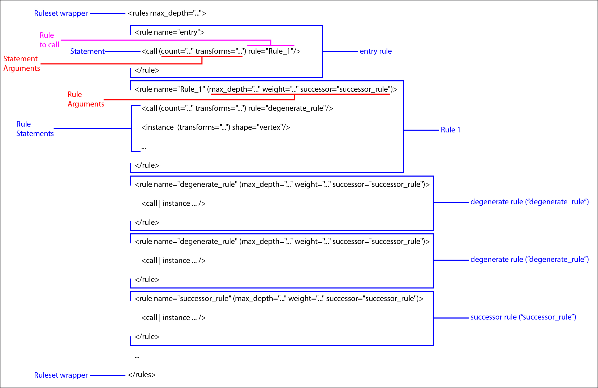
A few summary comments: 
- Rulesets may have any number of rules (as far as I know). 
- All rules, including the entry, may have any number of statements (as far as I know). 
- The entry rule is the only rule that doesn't take optional arguments, *maybe*. 
- Degenerate rules may have different arguments and statements (otherwise, what would the point be?). 
- Parenthesized arguments are optional. 
- Successors, weights, and degenerate rules, are all optional. 

In text form: 
```xml
<rules max_depth="..."> 
    <constants ...>
    <rule name="entry">
        <call (count="..." transforms="...") rule="Rule_1"/>
        ...            
    </rule>
    <rule name="Rule_1" (max_depth="..." weight="..." successor="successor_rule")>
        <call (count="..." transforms="...") rule="degenerate_rule"/>
        <instance  (transforms="...") shape="vertex"/>
        ...
    </rule>
    <rule name="degenerate_rule" (max_depth="..." weight="..." successor="successor_rule")>
        <call (count="..." transforms="...") rule="Rule_1"/>
        <call (count="..." transforms="...") rule="degenerate_rule"/>
        ...
    </rule>
    <rule name="degenerate_rule" (max_depth="..." weight="..." successor="successor_rule")>
        <call (count="..." transforms="...") rule="Rule_1"/>
        ...
    </rule>
    <rule name="successor_rule" (max_depth="..." weight="..." successor="successor_rule")>
        <call (count="..." transforms="...") rule="Rule_1"/>
        <instance  (transforms="...") shape="vertex"/>            
        ...
    </rule>
    ...
</rules>
```


## EisenScript to Sverchok XML Conversion
Next is how to translate a structure synth ruleset/EisenScript into the xml format used by Sverchok's generative art node. The best way to do this is probably to just pull up an EisenScript and point out directly how each element translates to XML. Consider the sample rule: 
```C
/*
  Sample EisenScript
*/
set maxdepth 100
r1
36  * { x -2 ry 10   } r1
rule r1 maxdepth 10 {
   2 * { y -1 } 3 * { rz 15 x 1 b 0.9 h -20  } r2
   { y 1 h 12 a 0.9  rx 36 }  r1
}
rule r2 {
   { s 0.9 0.1 1.1 hue 10 } box // a comment
}
rule r2 w 2 {
   { hue 113 sat 19 a 23 s 0.1 0.9 1.1 } box
}
```
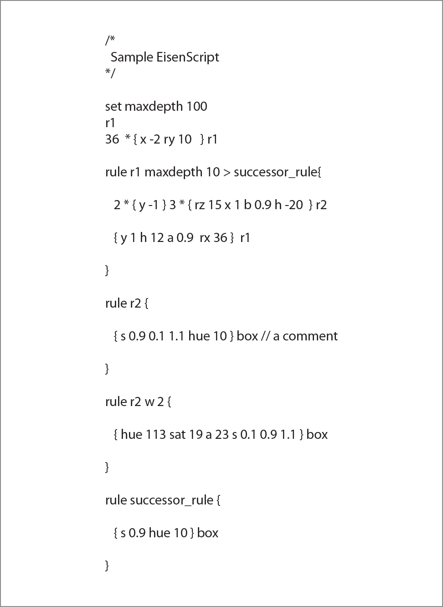

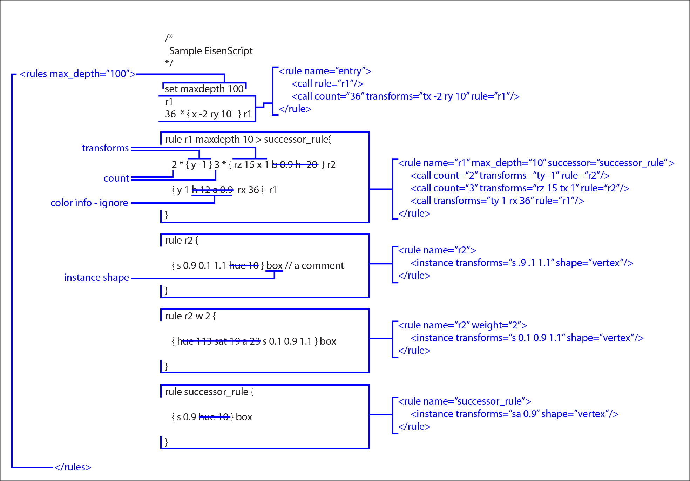

Result:
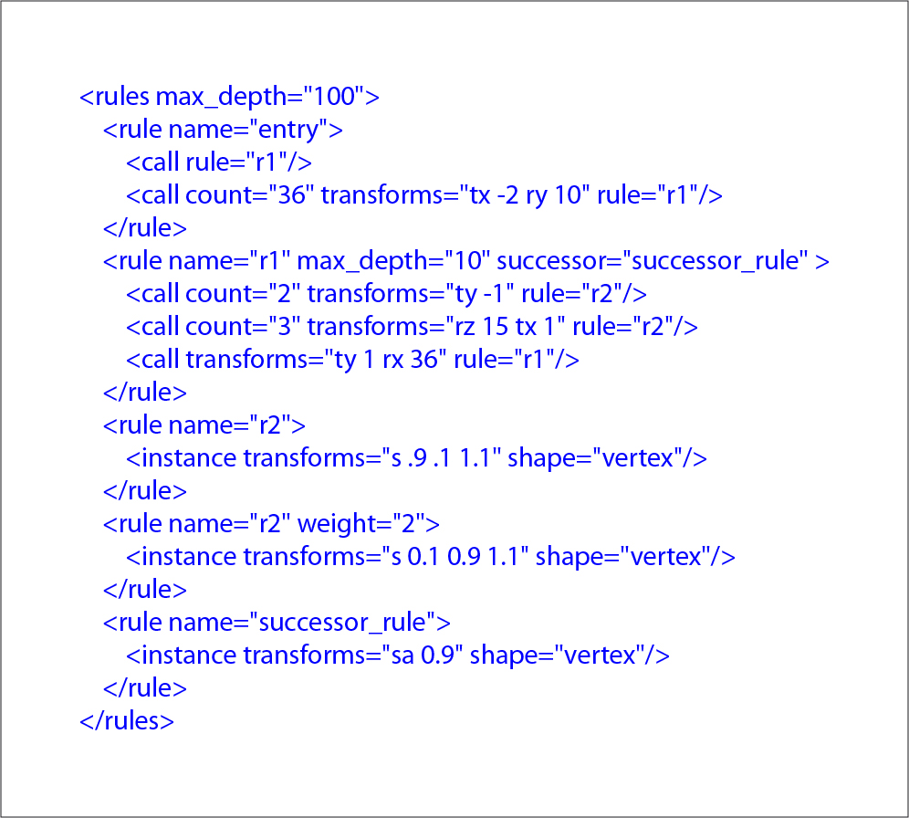

```xml
<!-- Sample EisenScript to XML -->
<!-- Astonishingly, works. -->
<rules max_depth="100">
    <rule name="entry">
        <call rule="r1"/>
        <call count="36" transforms="tx -2 ry 10" rule="r1"/>
    </rule>
    <rule name="r1" max_depth="10" successor="successor_rule" >
        <call count="2" transforms="ty -1" rule="r2"/>
        <call count="3" transforms="rz 15 tx 1" rule="r2"/>
        <call transforms="ty 1 rx 36" rule="r1"/>
    </rule>
    <rule name="r2">
        <instance transforms="s .9 .1 1.1" shape="vertex"/>
    </rule>
    <rule name="r2" weight="2">
        <instance transforms="s 0.1 0.9 1.1" shape="vertex"/>
    </rule>
    <rule name="successor_rule">
        <instance transforms="sa 0.9" shape="vertex"/>
    </rule>
</rules>
```

## The Generative Node in Practice / Blender Demonstration 
Now that we have an idea of how to convert EisenScripts to generative node XMLs, let's actually see what working with them in Sverchok looks like. This is Ankur Pawar's [fractal tree](https://github.com/ankurpawar/StructureSynth/blob/master/Tree/fractaltree1.png) rule, which I have already converted: 
```xml
<!-- Ankur Pawar [fractaltree2](https://github.com/ankurpawar/StructureSynth/blob/master/Tree/fractaltree2.es) -->
<!-- (as fractalTreeOriginal) -->
<rules max_depth="200">
    <rule name="entry">
        <call rule="tree"/>
    </rule>
    <rule name="tree" max_depth="6">
        <call transforms="tx .5 sa .49" rule="tree"/>
        <call transforms="tx .5 sa .49 rz 90" rule="tree"/>
        <call transforms="tx .5 sa .49 rz -90" rule="tree"/>
        <call transforms="tx .5 sa .49 ry -90" rule="tree"/>
        <call transforms="tx .5 sa .49 ry 90" rule="tree"/>
        <call rule="plus"/>
    </rule>
    <rule name="plus">
        <call transforms="tx .25 s .25 1 1 rz 90" rule="d"/>
    </rule>
    <rule name="d">
        <instance transforms="s .05 2 .05" shape="vertex"/>
    </rule>
</rules> 
```
- Load the fractalTreeOriginal xml. 
- Pass matrix output to `Viewer Draw` node matrix input, to show matrices are getting created. 
- Create a line generator, set to Y, center, **size 1.00** (this is *particularly* important), pass into `Viewer Draw`'s Vertices and Edges inputs, to show that this generates line segments perfectly along the path of the tree structure. 
    

So the first thing we probably notice is that the tree is "growing" dominantly along the x-axis, so it's kind of on it's side. I've had some success adjusting the rules to get them "z-up," e.g. with this one; the rule of thumb seems to be to take the main axis of translation in the top rule and change it to z, then replace the original axis with z everywhere, and vice versa. 

For this rule, that means `tx->tz`, and then `x->z`, `z->x`, everywhere. 
```xml
<!-- fractalTreeOriginal_zup -->
<rules max_depth="200">
    <rule name="entry">
        <call rule="tree"/>
    </rule>
    <rule name="tree" max_depth="6">
        <call transforms="tz .5 sa .49" rule="tree"/>
        <call transforms="tz .5 sa .49 rx 90" rule="tree"/>
        <call transforms="tz .5 sa .49 rx -90" rule="tree"/>
        <call transforms="tz .5 sa .49 ry -90" rule="tree"/>
        <call transforms="tz .5 sa .49 ry 90" rule="tree"/>
        <call rule="plus"/>
    </rule>
    <rule name="plus">
        <call transforms="tz .25 s 1 1 .25 rx 90" rule="d"/>
    </rule>
    <rule name="d">
        <instance transforms="s .05 2 .05" shape="vertex"/>
    </rule>
</rules> 
```
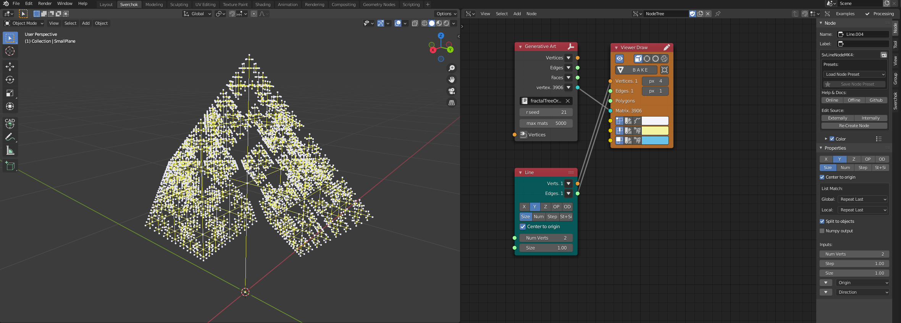
Importantly, note that the axis replacements include scale and rotation operations. 

That being said, I've also struggled with some rules I've converted to get them z-up. A perfectly acceptable alternative approach is to simply apply a new matrix to the generative node output to get it rotated/translated/scaled as desired: 

- Apply the generative output matrix to the line generator. 
- On that output, apply a new matrix, defining desired translation/rotation/scale. 
- Pass that output to the `Viewer Draw` node.

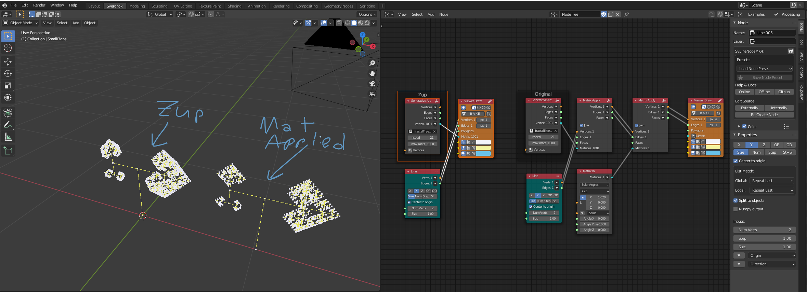

Okay great, this is a good start. But the fractal tree we have, while interesting, looks like some kind of oddly artificial Christmas tree, and otherwise not very natural. Luckily, we can start to get very tree-like structures just by varying the angles in the `tree` rule. 

- Set `tree` rule angles to 45 degrees, then experiment with them (22.5,-40,-40,35, for example, look alright). 

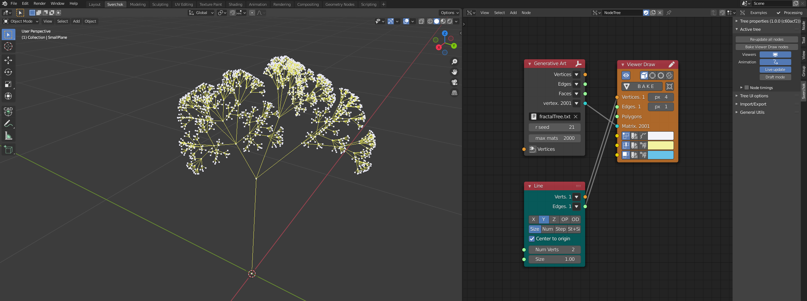

### **Matrix Per Segment** 
Once I got to this point originally, one of the first things I wanted to do was place objects at the tree's endpoints. You know, as leaves, or whatever. We can sort of achieve this pretty quickly, but using the endpoints (vertices of) the line segments we are using to draw the tree as the positions to place some generated object. 

- Apply Generative Art Matrix to line vertices and edges, to create position-only vertices for each segment's endpoints. 
- Pass the matrix-applied vertices to the matrix input of a `viewer draw`, to instance whatever shape at those positions. For example, a plane. 

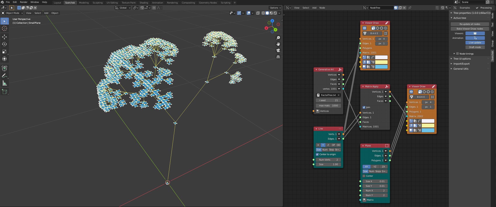

There are two problems here: 1), all the planes are facing the same direction (e.g. face-up), where I want them to be angled in the direction of their corresponding line segment

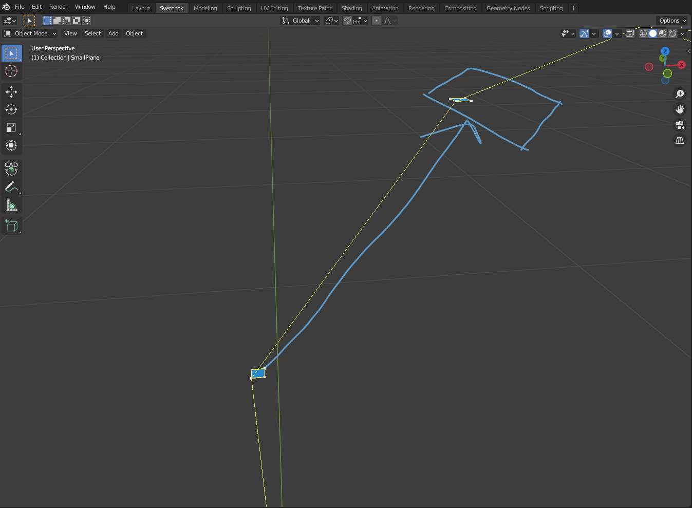

and 2), they are all the same size, where I want the instanced objects to get smaller as they get closer to branch endpoints. 

It turns out we can achieve both of these without too much trouble, which is really cool. 

First, let's get the orientation of each of the tree's line segments. It doesn't really matter, but it's worth noting that the tree is currently assembled from independent segments (rather than a single continuously joined one):

- Take two colors, list join them at level one, and pass into line color input of line segment `Viewer Draw` node. 

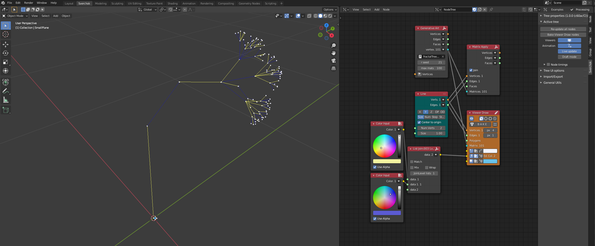

Assuming the direction of each segment is this vector: 

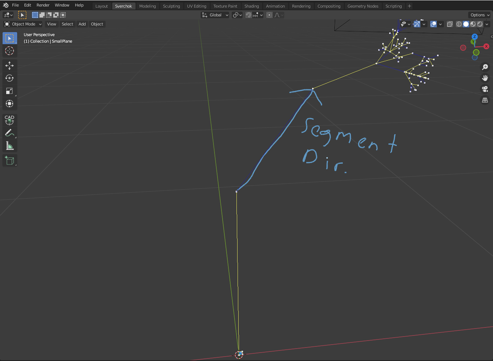

 One might think that we could get this simply as the tree's edges, but that's not quite right. The edges are defined by their vertex positions with respect to the world origin

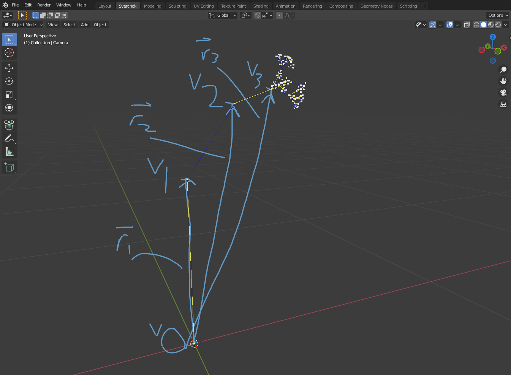

All we have to do, though, to get a segment's orientation is take the difference between the vectors pointing to its endpoint vertices. If we subtract the startpoint from the endpoint, the direction vector will "point up" in the direction the tree propagates: 

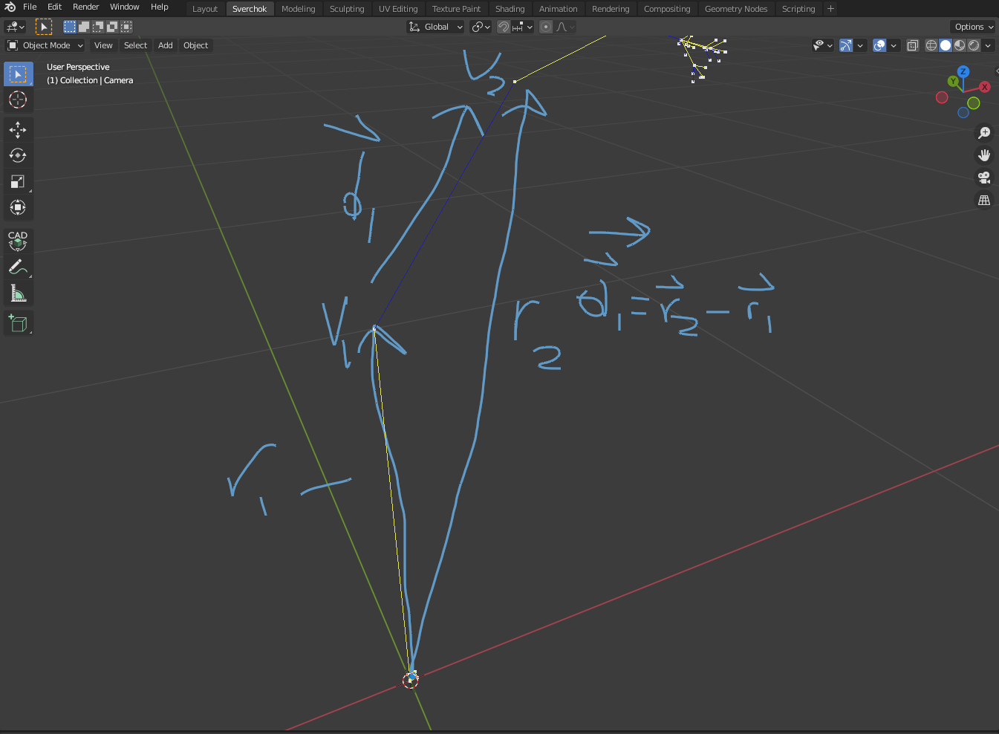 

So we need to calculate this direction vector for every single one of the tree's segments, preferably as simultaneously as possible. It's really helpful to look directly at the data we're working with, a really cool feature that Sverchok allows. The tree's lines are stored like this: 

- Plug the edges of the matrix-applied line into a `Viewer Text mk3 node`

```py
Socket DATA1; type EDGES/POLYGONS/OTHERS: 
(1) object(s)
=0=   (6)
(0, 1)
(2, 3)
(4, 5)
(6, 7)
(8, 9)
(10, 11)
```

and its vertices like this 

- Plug the lines of the matrix-applied line into a `Viewer Text mk3 node`

```py
Socket DATA0; type VERTICES: 
(1) object(s)
=0=   (12)
(0.0, -0.0002961913705803454, 1.4901161193847656e-08)
(0.0, 0.0002961913705803454, 0.5)
(7.450580596923828e-09, -0.00014513377391267568, 0.4999999701976776)
(0.14050307869911194, 0.00014513377391267568, 0.7007083892822266) 
(0.14050309360027313, -7.111555169103667e-05, 0.7007084488868713)
(0.2533037066459656, 7.111555169103667e-05, 0.7417939305305481)
(0.25330373644828796, -3.484662011032924e-05, 0.7417939901351929)
(0.3101290762424469, 3.484662011032924e-05, 0.7265887260437012)
(0.3101291060447693, -1.707484625512734e-05, 0.7265887260437012)
(0.3286669850349426, 1.707484625512734e-05, 0.7045167684555054)
(0.3286669850349426, -8.36667459225282e-06, 0.7045168280601501)
(0.32990604639053345, 8.36667459225282e-06, 0.6904475092887878)
```

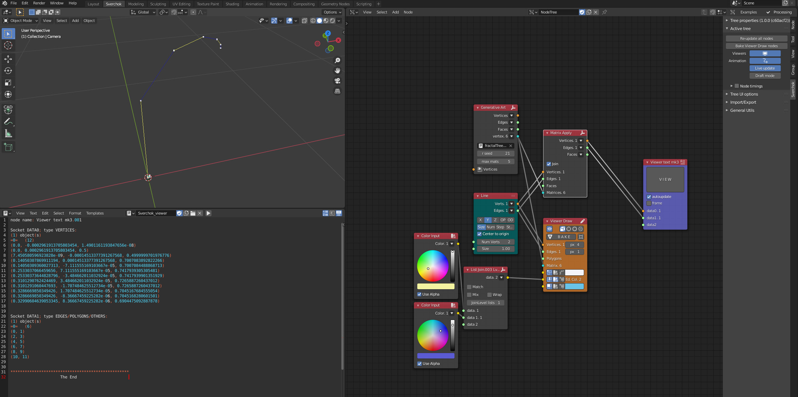

Conceptually, we can think of the lines as `l0`, `l1`, `l2`, ..., and similarly, the vertices as `v0`, `v1`, `v2`,... 

```py
l0 = (0, 1)
l2 = (2, 3)
l3 = (4, 5)
... 
v0 = (0.0, -0.0002961913705803454, 1.4901161193847656e-08)
v1 = (0.0, 0.0002961913705803454, 0.5)
v2 = (7.450580596923828e-09, -0.00014513377391267568, 0.4999999701976776)
v4 = (0.14050307869911194, 0.00014513377391267568, 0.7007083892822266) 
...
```

Then, the relationship between the lines and the vertices is 

```py
l0 = (v0, v1)
l1 = (v2, v3)
l2 = (v3, v4)
... 
li = (vi,v{i+1})
...
```

I.e. 

```py
       ┌──────┐    ┌──────────────────── v0 ─────────────────────────┐
l0 ── (0, 1)  └── (0.0, -0.0002961913705803454, 1.4901161193847656e-08)
          └────── (0.0, 0.0002961913705803454, 0.5)
                   └────────── v1 ───────────────┘

       ┌──────┐    ┌─────────────────────────────── v2 ─────────────────────────────┐
l1 ── (2, 3)  └── (7.450580596923828e-09, -0.00014513377391267568, 0.4999999701976776)
          └────── (0.14050307869911194, 0.00014513377391267568, 0.7007083892822266) 
                   └─────────────────────────── v3 ──────────────────────────────┘
```

And with respect to the actual tree 

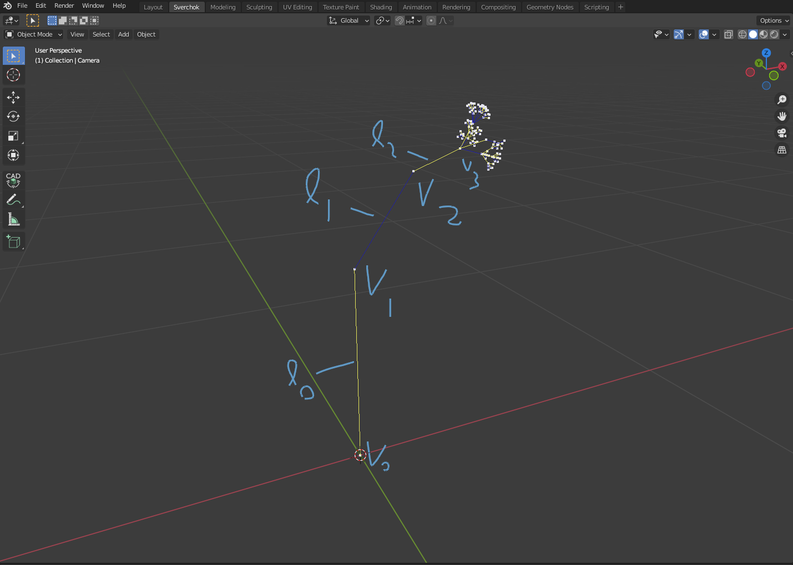

And, ultimately, what we want to do is take the position of the first vertex of each line, and subtract it from the position of its second. In terms of the data we're looking at, something like this: 

```py
l0 = (v0, v1) -> d0 = v1 - v0 
l1 = (v2, v3) -> d1 = v3 - v2
l2 = (v4, v5) -> d2 = v4 - v5
... 
li = (v{2xi}, v{2xi+1}) -> di = v{2xi+1} - v{2xi}
...
```

What we can do is take the whole list of lines that make up the tree, and from each extract just their first index (position zero), using Sverchok's `List Item` node. 

- Plug matrix-applied line edges into `List Item` node, set to level 3, index 0, Flatten and Wrap (note you have to turn those extra options on explicitly, a must), and show the output. 

Then, we can use this list to extract the *vertices* corresponding to the starting points of every line, using another `List Item` node, this time selecting from the set of the tree's vertices. 

- Create another `List Item` node, plug applied vertices into it, plug `Start Inds` `Item` output into index field, show result. **Note that the level needs to be set to 2, this time.** 

```py
list = 
    l0(0) = v0
    l1(0) = v2
    l2(0) = v4
    ... 
```

We can do exactly the same thing for the second index (position 1 value) of each line, to get each's endpoint positions. 

- Create a new `List Item` node, plug applied line edges, set to level 3, **index 1**, Flatten and Wrap.
- Create a new `List Item` node, plug applied *vertices* into it, and previous `List Item` node's output list into index selector. Make sure `List Item` node is set to level 2. 

```py
list = 
    l0(1) = v1
    l1(1) = v3
    l2(1) = v5
    ... 
```

So we should have something that looks like this at this point
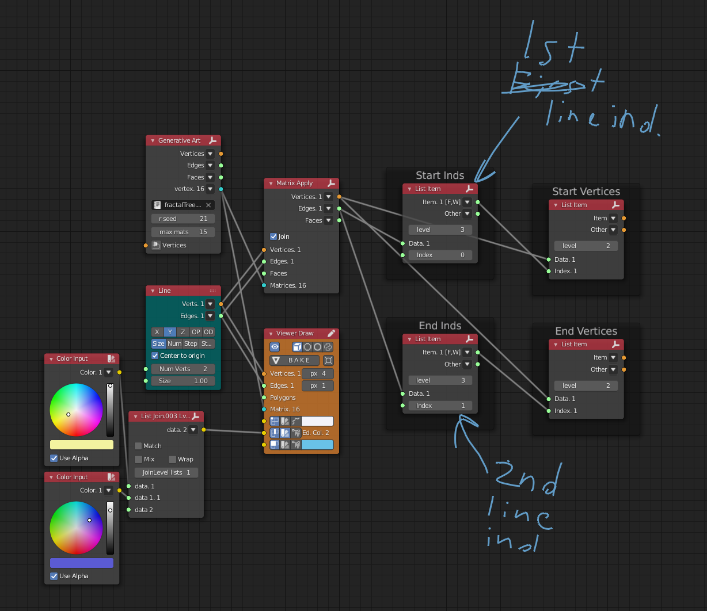

Now, to get the direction vector of each line segment, all we need to do is subtract the startpoints list from the endpoints list: 

- Create a vector math node, set to subtract, subtract `Start Vertices` list from `End Vertices`. 

```py
sub = 
    l0(1) - l0(0) = v1 - v0
    l1(1) - l1(0) = v3 - v2
    l2(1) - l2(0) = v5 - v4
    ... 
```

To create an "orientation matrix" from these direction vectors, we can pass them into the very handy `Matrix normal` node. Note that we want to normalize the direction vectors first (although this doesn't seem to be necessary, it appears the `Matrix normal` node normalizes its `Normal` input. I'm going to do it anyway, though, for clarity.)

- Duplicate `SUB` node and set to `NORMALIZE`, plug `SUB` output into it. 
- Create a `Matrix normal` node and plug the output of the `NORMALIZE` node into it, and then display with a viewer draw. Also set `track = -Z` and `up = Z` (this just defines which of the matrix's axes we want aligned with the normal input). 

So, what do we have Now? A jumble of matrices at the origin. 

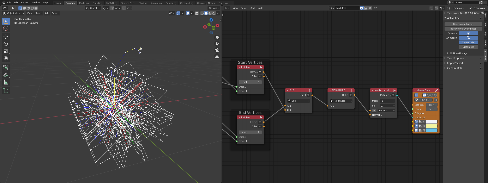

Why aren't they attached to the tree's endpoints? Because they don't inherently know that information. All they "know" is a direction, and are defaulting to the world origin for their position. 

This is easy to solve, though, just pass the endpoint vertices into the `Matrix normal` node's `Location` input (also, scale the matrices down, so that we can see what's going on). 

- Pass `End Vertices` into `Matrix normal` `Location` input. 
- Create a `Matrix Multiply` node, plug `Matrix normal` output into `A` input, create a new matrix for input `B`, create a `Number` node, and plug that into new matrix's `Scale` input. Scale the matrix down, and pass multiplied matrix into viewer. 

Nodes should look about like as follows 

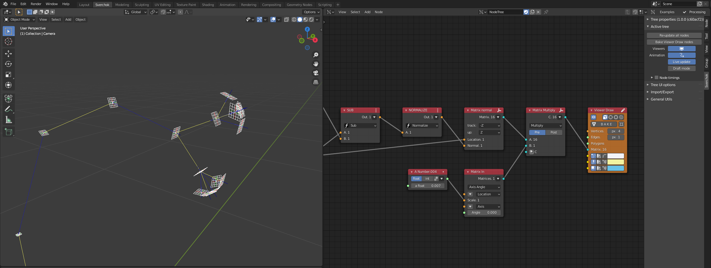

- So this is a good progress, we can show an example of how we can use these matrices to instance an object onto the endpoints of the tree segments, with it oriented along them. Just use any generator. 

Okay, very cool. That was really probably the hardest bit of the whole thing. I'm not going to really do anything more complicated than that. 

### **Scale Per Segment**
Now that we at least have their orientations right, let's deal with that each matrix (and therefore whatever object we use them to instance) is the same size. To me, the low hanging fruit here (pun...intended?), was to see if I could adjust the scale of each segment's matrix in proportion to that segment's *length*. 

And, Sverchok has just what we need: the `Path Length` node. If we take our original vertices and edges and pass them into this node, it will immediately give us the length of each segment, without any further hassle. 

- So, do that. Create `Path Length` node, pass tree vertices and edges into it. 

```py
Path Length:SegmentLength = 
    0.5000003360160382 = length(l0)
    0.24500013627942765  = length(l1) 
    0.12005005345714641  = length(l2) 
    ...
```

We have exactly as many line segments as vertices, and the segment lengths should match up perfectly, so let's just see what happens when we plug the path lengths in as a scale on our direction matrices? 

- Create `Matrix Multiply` node, pass direction matrices into input `A`, create a new matrix for input `B`, pass segment lengths into scale of new matrix, and pass multiplied matrix into viewer. We can also add an additional scaling matrix into input `C`. 

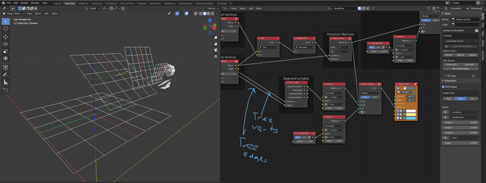

We can see now that the matrices are getting smaller as they go "up" the tree, though, really, as the length of their corresponding segment gets shorter. 

Well, that was easy. 

Alright, one last thing I want to do, and then we can play around with some stuff. 

If Multiply our multiplied matrix again, (either create a new matrix for input `D`, or a new `Matrix Multiply` node), notice how the matrices move along their segments as we adjust the multiplier matrix's `Z` value. 

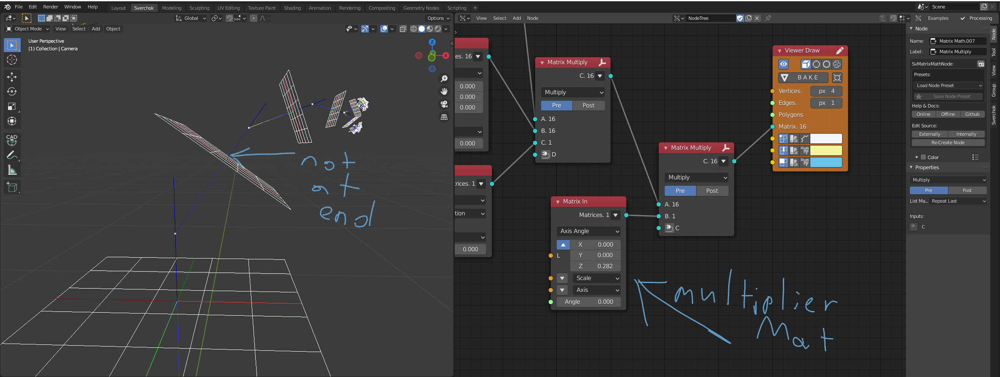

If we set this `Z` value/offset to be half of the length of the line segment, then it should center the matrix on that line. We have the segment lengths, all we need to do is multiply them by 0.5 (divide them by two), and pass them into the multiplier matrix's `Z` input. 

- Oh, right, you can't just plug a scaler into a vector input. Create a, confusingly, vector...in node? I can never remember. 
- Pass scaled segments into `Z`, and leave `X` and `Y` at 0. 
- Right, classic. Why aren't they in the middle? I ran into this problem before. It's because we are scaling the matrices before hand (by the segment lengths). This affects how far it moves for a given distance input. 
- So the best way to resolve this is to apply the position  change along the segment *before* the scale change. 
- Remove the scaled segment lengths from the `Matrix Multiply`'s `B` input. 
- Divide the segments in half, pass them into the `Z` input a `Vector in`, and pass this into the `Location` input of a new matrix multiplying the Direction Matrices. 
- Then, take the previous `Matrix In`,  scaled by the segment lengths, and multiply the offset matrices by this. 

Nodes should look roughly like this: 

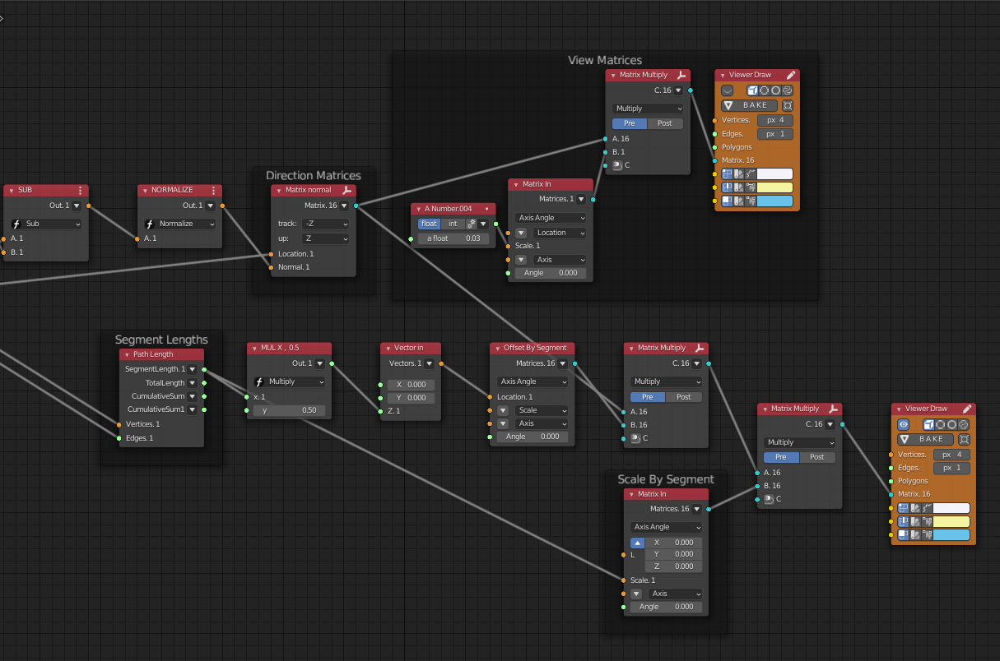

And now, with the segments length's multiplied by 0.5, the orientation matrices are exactly centered on their individual segments. 

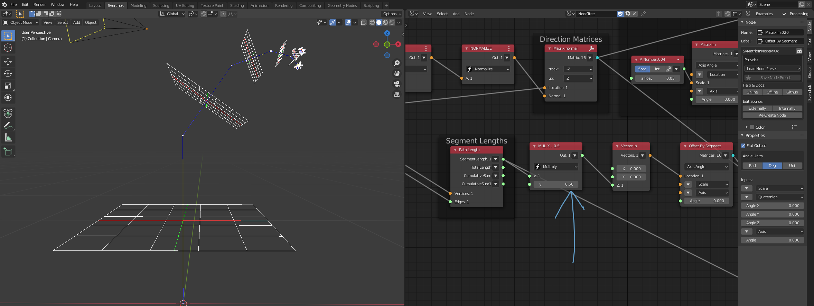

Furthermore, we can use the segments length multiplier as a 0-1 offset to adjust where each matrix is on its edge. Cool. 

It's worth looking at the entirety of the node setup we put together, which I don't think is that much: 

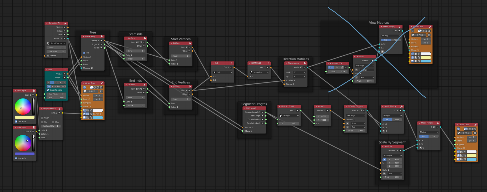

## Some final examples, Experimentation, and Open Discussion
So first of all, we can now instance whatever onto each oriented, offset, and scaled matrix. Suzanne, naturally. 

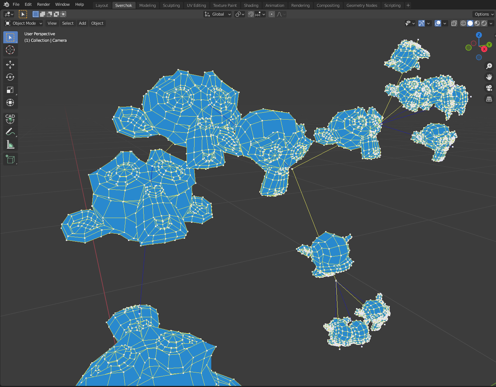

Another good one is going back to our original matrix output (the one from our `Generative Art` node), and using those matrices to instance an object. For example, a tapered cylinder (particularly, at the ruleset's scale factor). 


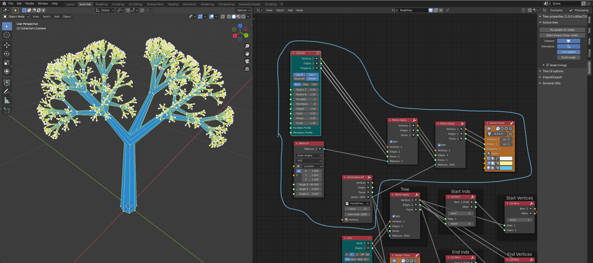

This is actually as important as anything I've discussed so far, and is sometimes the simplest way to what you might be after: 

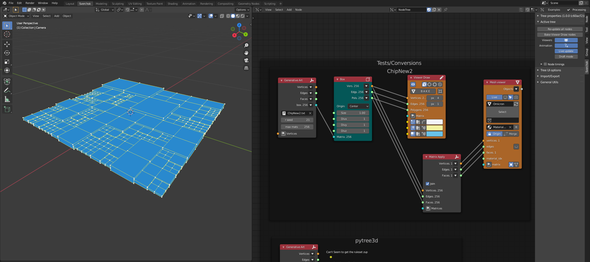

### **Some things I might try to do live**
Or, play with before hand, but not necessarily explicitly add to this tutorial. 
- Mask orientation matrices by branch termination (only one neighbor vertex), to add some control over where object's are instanced on the tree. 
- Instancing custom vertex or matrix assemblies onto the orientation matrices, e.g. phyllotaxis arrays. 

### **Other Comments**
- [ ] Motivation. 
- [ ] Early experiments, frustrations, trying to understand things. 

# Converted Rules
```xml
<!-- Structure Synth Torus Example -->
<rules max_depth="100">
    <rule name="entry">
        <call rule="r1"/>
        <call count="36" transforms="tx -2 ry 10" rule="r1"/>
    </rule>
    <rule name="r1" max_depth="10">
        <call count="2" transforms="ty -1" rule="r2"/>
        <call count="3" transforms="rz 15 tx 1" rule="r2"/>
        <call transforms="ty 1 rx 36" rule="r2"/>
    </rule>
    <rule name="r2">
        <call count="2" transforms="ty -1" rule="r2"/>
        <call count="3" transforms="rz 15 tx 1" rule="r2"/>
        <instance transforms="s .9 .1 1.1" shape="vertex"/>
    </rule>
    <rule name="r2" weight="200">       
        <instance transforms="s .1 .9 1.1" shape="vertex"/>
    </rule>
</rules> 
```

```xml
<!-- Ankur Pawar Spiral Tree 2 -->
<rules max_depth="520">
    <rule name="entry">
        <call rule="stem"/>
        <call rule="spiral"/>        
        <call transforms="ry 180" rule="spiral"/>
    </rule>
    <rule name="stem" max_depth="20">
        <instance transforms="s .9 .1 1.1" shape="vertex"/>
        <call transforms="ty -1" rule="stem"/>
    </rule>
    <rule name="spiral">
        <call rule="spiral"/>
        <call transforms="ry 180" rule="spiral"/>
    </rule>
    <rule name="spiral" weight="50" max_depth="100" successor="leaf">
        <call transforms="ty .4 rz 3 sa .993" rule="spiral"/>
        <instance shape="vertex"/>
    </rule>
    <rule name="spiral" weight="30" max_depth="300" successor="leaf">
        <call transforms="ty .4 rz 3 sa .995" rule="spiral"/>
        <instance shape="vertex"/>
    </rule>
    <rule name="leaf">
        <instance transforms="s 3.5 3.5 .75 rz 30" shape="vertex"/>
    </rule>
</rules> 
```

```xml
<!-- Ankur Pawar [Pythagoras Tree](https://github.com/ankurpawar/StructureSynth/blob/master/Pythagoras/PythagorasTree.es) -->
<rules max_depth="12">
    <rule name="entry">
        <call rule="R1"/>
    </rule>
    <rule name="R1" max_depth="11">
        <call transforms="ty 2 tx 2 rz -45 sa .707" rule="R1"/>
        <call transforms="ty 2 tx -2 rz 45 sa .707" rule="R1"/>
        <instance shape="vertex"/>
    </rule>
</rules> 
```

```xml
<!-- Ankur Pawar [Pythagoras Tree](https://github.com/ankurpawar/StructureSynth/blob/master/Pythagoras/PythagorasTree.es) -->
<rules max_depth="12">
    <rule name="entry">
        <call rule="a2"/>
    </rule>
    <rule name="a2" weight="3" max_depth="3" successor="d">
        <call transforms="sa .5 tx .5 ty .5" rule="a2"/>
        <call transforms="sa .5 tx -.5 ty .5" rule="a2"/>
        <call transforms="sa .5 tx .5 ty -.5" rule="a2"/>
        <call transforms="sa .5 tx -.5 ty -.5" rule="a2"/>
    </rule>
    <rule name="a2" weight="1" max_depth="1" successor="d">
        <call transforms="s .5 1 tx .5" rule="a2"/>
        <call transforms="s .5 1 tx .5" rule="a2"/>
    </rule>
    <rule name="d" max_depth="11">
        <instance transforms="s 1 1 .25" shape="vertex"/>
    </rule>
</rules> 
```

```xml
<!-- Ankur Pawar [ChipNew2](https://github.com/ankurpawar/StructureSynth/blob/master/Chip/ChipNew2.es) -->
<!-- Experiment with max_depth on first two rules. Small numbers, <10.  -->
<rules max_depth="200">
    <constants depth="3"/>
    <rule name="entry">
        <call rule="a2"/>
    </rule>
    <rule name="a2" weight="3" max_depth="3" successor="d">
        <call transforms="sa .5 tx .5 ty .5" rule="a2"/>
        <call transforms="sa .5 tx -.5 ty .5" rule="a2"/>
        <call transforms="sa .5 tx .5 ty -.5" rule="a2"/>
        <call transforms="sa .5 tx -.5 ty -.5" rule="a2"/>
    </rule>
    <rule name="a2" weight="3" max_depth="2" successor="d">
        <call transforms="sa .5 tx .5 ty .5" rule="a2"/>
        <call transforms="sa .5 tx -.5 ty .5" rule="a2"/>
        <call transforms="sa .5 tx .5 ty -.5" rule="a2"/>
        <call transforms="sa .5 tx -.5 ty -.5" rule="a2"/>
    </rule>
    <rule name="a2" weight="1" max_depth="1" successor="d">
        <call transforms="s .5 1 tx .5" rule="a2"/>
        <call transforms="s .5 1 tx .5" rule="a2"/>
    </rule>
    <rule name="d" weight="2">
        <instance transforms="s 1 1 .25" shape="box"/>
    </rule>
</rules> 
```
Amazing (output-> mesh viewer-> bevel)
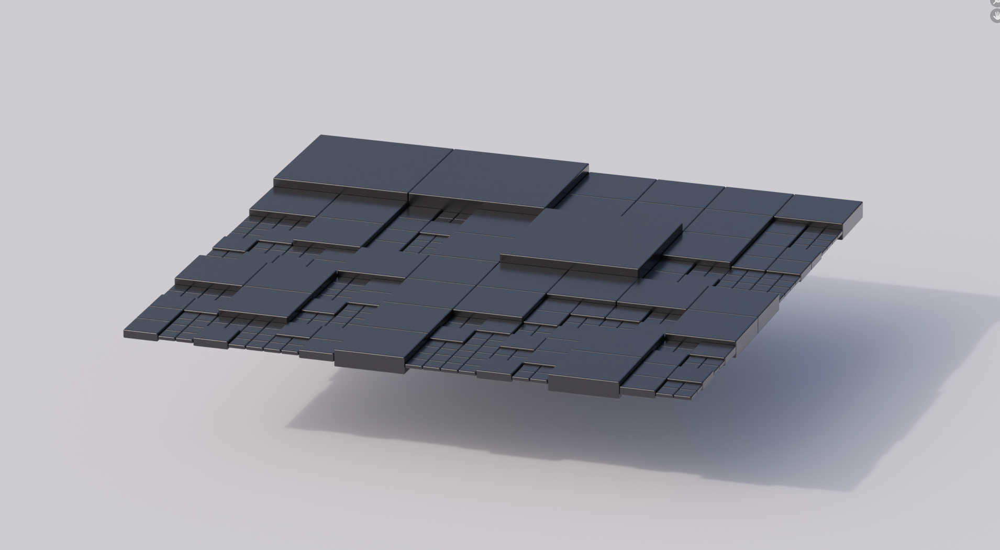

```xml
<!-- [pytree3d](https://github.com/ankurpawar/StructureSynth/blob/master/Pythagoras/pytree3d.es) -->
<!-- Excellent. -->
<rules max_depth="200">
    <constants displace=".25"/>
    <rule name="entry">
        <call rule="R1"/>
    </rule>
    <rule name="R1" max_depth="5" successor="R2">
        <call transforms="ty .75 tx {displace} rz -45 sa .707" rule="R1"/>
        <call transforms="ty .75 tx -{displace} rz 45 sa .707" rule="R1"/>
        <call transforms="ty .75 tz {displace} rx 45 sa .707" rule="R1"/>
        <call transforms="ty .75 tz -{displace} rx -45 sa .707" rule="R1"/>
        <instance transforms="s .1 1 .1" shape="vertex"/>
    </rule>
    <rule name="R2">
        <instance transforms="s .1 1 .1" shape="vertex"/>
        <!-- Comment line below this to suppress matrix at branch endpoint -->
        <instance transforms="ty .5 sa .5" shape="vertex"/>
    </rule>
    <!-- Nothing below here seems to get called? -->
    <rule name="d">
        <instance transforms="s .1 .9 .9 tx 5" shape="vertex"/>
        <instance transforms="s .1 .9 .9 tx -5" shape="vertex"/>
        <instance transforms="s .9 .1 .9 ty 5" shape="vertex"/>
        <instance transforms="s .9 .1 .9 ty -5" shape="vertex"/>
        <instance transforms="s .9 .9 .1 tz 5" shape="vertex"/>
        <instance transforms="s .9 .9 .1 tz -5" shape="vertex"/>
    </rule>
    <rule name="frame">
        <instance transforms="s .1 1.1 .1 tx 5 tz 5" shape="vertex"/>
        <instance transforms="s .1 1.1 .1 tx 5 tz -5" shape="vertex"/>
        <instance transforms="s .1 1.1 .1 tx -5 tz 5" shape="vertex"/>
        <instance transforms="s .1 1.1 .1 tx -5 tz -5" shape="vertex"/>
        
        <instance transforms="s 1 .1 .1 ty 5 tz 5" shape="vertex"/>
        <instance transforms="s 1 .1 .1 ty 5 tz -5" shape="vertex"/>
        <instance transforms="s 1 .1 .1 ty -5 tz 5" shape="vertex"/>
        <instance transforms="s 1 .1 .1 ty -5 tz -5" shape="vertex"/>

        <instance transforms="s .1 .1 1 ty 5 tx 5" shape="vertex"/>
        <instance transforms="s .1 .1 1 ty 5 tx -5" shape="vertex"/>
        <instance transforms="s .1 .1 1 ty -5 tx 5" shape="vertex"/>
        <instance transforms="s .1 .1 1 ty -5 tx -5" shape="vertex"/>
    </rule>
</rules> 
```

```xml
<!-- [pytree3d](https://github.com/ankurpawar/StructureSynth/blob/master/Pythagoras/pytree3d.es) -->
<!-- Excellent. -->
<rules max_depth="200">
    <constants displace=".25"/>
    <rule name="entry">
        <call rule="R1"/>
    </rule>
    <rule name="R1" max_depth="5" successor="R2">
        <call transforms="ty .75 tx {displace} rz -45 sa .707" rule="R1"/>
        <call transforms="ty .75 tx -{displace} rz 45 sa .707" rule="R1"/>
        <call transforms="ty .75 tz {displace} rx 45 sa .707" rule="R1"/>
        <call transforms="ty .75 tz -{displace} rx -45 sa .707" rule="R1"/>
        <instance transforms="s .1 1 .1" shape="vertex"/>
    </rule>
    <rule name="R2">
        <instance transforms="s .1 1 .1" shape="vertex"/>
        <!-- Comment line below this to suppress matrix at branch endpoint -->
        <instance transforms="ty .5 sa .5" shape="vertex"/>
    </rule>
</rules> 
```

```xml
<!-- Simplification of [3dtree](https://github.com/ankurpawar/StructureSynth/blob/master/Tree/3dtree.es) -->
<!-- Promising. -->
<rules max_depth="500">
    <rule name="entry">
        <call transforms="ry 90" rule="spiral"/>
    </rule>
    <rule name="spiral" weight="100" max_depth="400">
        <call transforms="ty .2 rx 1 ry 1 sa .993" rule="spiral"/>
        <instance shape="vertex"/>
    </rule>
    <rule name="spiral" weight="1">
        <call rule="spiral"/>
        <call transforms="ry 180" rule="spiral"/>
    </rule>
</rules> 
```

```xml
<!-- Z-up (y->z, z->y) Simplification of [3dtree](https://github.com/ankurpawar/StructureSynth/blob/master/Tree/3dtree.es) -->
<rules max_depth="500">
    <rule name="entry">
        <call transforms="rz 90" rule="spiral"/>
    </rule>
    <rule name="spiral" weight="100" max_depth="400">
        <call transforms="tz .2 rx 1 rz 1 sa .993" rule="spiral"/>
        <instance shape="vertex"/>
    </rule>
    <rule name="spiral" weight="1">
        <call rule="spiral"/>
        <call transforms="rz 180" rule="spiral"/>
    </rule>
</rules> 
```

```xml 
<!-- Tree-like fractalTree -->
<!-- Vary Angles, Scale. -->
<rules max_depth="200">
    <rule name="entry">
        <call rule="tree"/>
    </rule>
    <rule name="tree" max_depth="6">
        <call transforms="tz .5 sa .49" rule="tree"/>
        <call transforms="tz .5 sa .49 rx 22.5" rule="tree"/>
        <call transforms="tz .5 sa .49 rx -40" rule="tree"/>
        <call transforms="tz .5 sa .49 ry -40" rule="tree"/>
        <call transforms="tz .5 sa .49 ry 35" rule="tree"/>
        <call rule="plus"/>
    </rule>
    <rule name="plus">
        <call transforms="tz .25 s 1 1 .25 rx 90" rule="d"/>
    </rule>
    <rule name="d">
        <instance transforms="s .05 2 .05" shape="vertex"/>
    </rule>
</rules> 
```