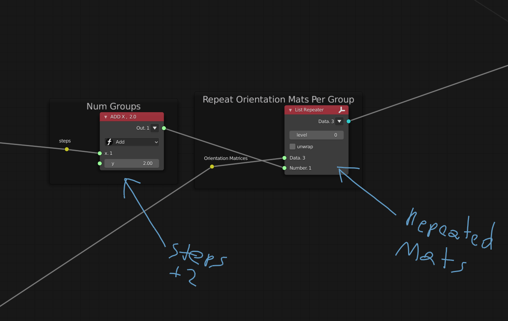

# The Merged Endpoints Tree 
- [The Merged Endpoints Tree](#the-merged-endpoints-tree)
    - [<u>**Merging the Tree**</u>](#umerging-the-treeu)
    - [<u>**Why Sort the Merged Path?**</u>](#uwhy-sort-the-merged-pathu)
    - [<u>**Orientation Matrices Etc.**</u>](#uorientation-matrices-etcu)
    - [<u>**Locating Endpoints**</u>](#ulocating-endpointsu)
    - [<u>**Group by distance/steps from endpoint**</u>](#ugroup-by-distancesteps-from-endpointu)
    - [<u>**Group Matrices by Property (distance from endpoints)**</u>](#ugroup-matrices-by-property-distance-from-endpointsu)
    - [<u>**Affect Matrices by Group Property (Distance from endpoint)**</u>](#uaffect-matrices-by-group-property-distance-from-endpointu)
    - [<u>**Instancing Matrix Assemblies on Orientation Matrices**</u>](#uinstancing-matrix-assemblies-on-orientation-matricesu)
    - [<u>**Summary**</u>](#usummaryu)
    - [<u>**A few final thoughts**</u>](#ua-few-final-thoughtsu)
- [Notes](#notes)


### <u>**Merging the Tree**</u>
In Part 1, we were working with an unmerged tree, in the sense that it was made up of a bunch of unconnected lines instanced by the generative art node. While not necessarily a problem we can't work around, it does mean that the tree has double vertices piled on top of each other. 


By the way, the `Viewer Index+` node is what I'm using to draw indexes on the tree elements, and is super cool and useful. 

Even with the vertex doubles, this structure is nice to work with because it's sorted, i.e. there is a nice correspondence between the line segments and the vertices: line 0 consists of the vertices 0 and 1, line 2 of 2 and 3, and in general, line `i` to `2i` and `2i+1`. 

```python
# line-vertex correspondence
l0 = (v0,v1)
l1 = (v2,v3)
l0 = (v4,v5)
...
li = (v{2i},v{2i+1})
```

In case you don't believe me, we can demonstrate this correspondence by selecting the vertices for a given line index, then use them to draw a line, without using any of the actual line data coming from the tree. 


Notice also that if we look at our lines list, they are nice and ordered. 
```python
=0=
(0, 1)
(2, 3)
(4, 5)
(6, 7)
(8, 9)
...
```

*Buuuut*, still, the double vertices are inefficient, and even with performance considerations aside, it's just generally considered bad practice to leave doubles in your model. 

The problem is, if we merge the tree's vertices, (using the `Merge by Distance` node), the lines go out of order. 


This disorder can be seen from looking at the list of lines, which is not in any order that I can identify
```python
# Merged Lines 
=0=   (18)
[5, 6]
[12, 13]
[17, 18]
[0, 1]
[1, 2]
[2, 3]
[3, 10]
[10, 5]
... ??
```

**The short answer to solving this problem of resorting the lines is to rearrange them in the order of their second index/endpoint vertex.** Skip the next couple paragraphs if you're not interested in my attempt at explaining why this somewhat makes sense. 

First of all, I didn't *really* know how to resolve this problem when I encountered it, and in fact *guessed* that a solution might be to order the lines by their second index (essentially, by their endpoints). The basis for this comes from the ambiguity created at junctions. A given vertex can only *ever* "point backwards" to one, unique line, but (at junctions), it can "point forward" to multiple lines. 


Basically, a junction splits *one, unique* line into many. So there should be no ambiguity in assigning a junction vertex to the line that *becomes split* there, while the reverse is not true. Junctions always occur at the endpoint of the split line, so it follows that the lines', endpoints, rather than originators, are their unique identifiers, and by extension our sorting criteria. 

Don't get me wrong, this is hard to explain. I'm still mulling it over somewhat myself. It maybe helps to think of this as reordering the lines to match the vertex order, or assigning lines *to* vertices, rather than vertices *to* lines (we are resorting the list of lines, *not* the list of vertices).

By at any rate, I don't think this solution is at all obvious, necessarily, and there may even be some genuinely interesting mathematics in here.

At the end of the day, though, we're after rearranging our list of lines into this order

```python
# Sorted Lines (by endpoints)
=0=
[0, 1]
[1, 2]
[2, 3]
[5, 4]
[10, 5]
[5, 6]
[5, 7]
[5, 8]
```

Accomplishing this isn't really that complicated a process, but it's kind of confusing. The operations are pretty much 

- For every line, insert that line into a list at the position of its second index, -1 (-1 basically because lists start at 0, not 1, for example line `[0,1]` needs to be rearranged into slot `0`, `[1,2]` into slot `1`, and so on). 

Hopefully this diagram is helpful


And in nodes: 


Note that we are reusing our original list of lines because it's exactly the right size, and that way we don't have to assemble a new list. 

### <u>**Why Sort the Merged Path?**</u>
Reiterating a little bit, the reason the unmerged tree is nice to work with is because there is a simple correspondence between lines and vertices, in that given a vertex index, we know conclusively what line it belongs to, and vice versa. 

After merging the tree, because some vertices become shared between multiple lines, it becomes unclear what line to "assign" a given vertex to. By resorting the lines by their endpoints, we reestablish a unique line-vertex correspondence that we actually understand, unlike whatever one the merging process produced. 

### <u>**Orientation Matrices Etc.**</u>
From here, the process of determining the orientation matrices, scaling them by segment length, and offsetting them along their corresponding segments, is practically identical to how it was dealt with in part 1. The node setups are in fact almost exactly the same, save minor improvements with no bearing on the underlying logic, e.g. tracking `Z` and setting up as `X` on the `Matrix Normal` node. 

Maybe for completeness I'll go through it here, but I think it's okay to leave for later. 

Also, I think it's still useful to leave the matrix scaling by segment length in, even though something similar could now be done using their distance from endpoints. 

### <u>**Locating Endpoints**</u>
From the beginning, one of the main things I wanted to figure out was how to apply effects to objects instanced along the tree based on how far they are from an endpoint. For example, say instancing some flower-like assembly along each point, so that the flower is more in bloom the closer it is to an endpoint. 


One way or another, to do something like this, we need to identify the tree's endpoints. The endpoint condition is pretty simple and easy to understand, and Sverchok gives us the tools necessary to identify them, but things *still* start to get a bit tricky from here on. Not so much conceptually, necessarily, but in finagling Sverchok into doing what you want. The main takeaway for me, from my struggles (which were not insignificant), was that data/list structure is really, really important in Sverchok. Much more so than I had originally thought. 

Ok but first of all, what is the endpoint condition for a vertex, and how do we test for it? 

Testing is achieved using the `Linked Verts` Node, because Sverchok provides all things good


And the endpoint condition is satisfied by a vertex when it is linked to **only one** other vertex. 


So we are after a list of (the indexes corresponding to) every vertex that satisfies the endpoint condition. The first thing I tried to do was pass a list of all the vertex indexes to the `Linked Verts` node. This doesn't work, for a kind of subtle reason. It's down to how the `Linked Verts` node operates, which excludes selected vertexes from the linked set, or something. So, for example, if I choose verts 1 and 2, it basically returns the vertexes connected to the line they comprise: 


So if we select every vertex in the tree...then there are no vertexes left for them to be joined to, so the `Linked Verts` node returns nothing: 


Alright, have to find another solution. What? The answer ends up being to wrap each vertex index in its own list, using the `List Split` node. So where the list of all the vertex indexes (created as a `Number Range`, as long as the number of vertexes in the tree) looks like this, normally: 

```
Vertex Indexes, Unsplit: 
=0=
0 <- v0 
1 <- v1 
2 <- v2 
3 <- v3 
...
```

This same list, passed through a `List Split` node, becomes this: 

```
Split Vertices = 
=0=   (1)
0           <- v0
=1=   (1)
1           <- v1
=2=   (1)
2           <- v2
=3=   (1)
3           <- v3
...
```

With this arrangement, each split is treated separately, such that passing it through `Linked Verts` node groups vertices by what vertex they are linked to, as we want.

```python
# Linked Verts
Linked Verts(Split Vertices) = 
=0=
1 ────────── Linked to v0 
=1=
0 ─┬──────── Linked to v1
2 ─┘
=2=
1 ─┬──────── Linked to v2 
3 ─┘
=3=
2 ─┬──────── Linked to v3
4 ─┘
...
```

> Just FYI: I discovered this basically by accident, trial and error at best, and I wasn't even working on the same problem at the time. 


This trick, and variations thereof, are going to be used a lot going forward. 

Now, we can find the endpoint vertexes by counting number of values in each group output by the `Linked Verts` node. If a list only contains one item, it must be an endpoint. 

- The number of elements in each group of the `Linked Verts` list can be counted using a `List Statistics` node set to `Count`.
- A `Logic Functions` node can be used on this result to determine if the number of elements in each group is equal to 1. 
- And then a `Mask to index` node can be used to convert the result of the Logic node from a list of True/False values to a set of indexes, essentially giving us the index of each vertex that is an endpoint. 


Why is the list unwrapped now? No idea. All I can say is it seems to be the `Count/List Statistics` node's fault. 

Anyway, we can see that if we select for these endpoints indexes from the original list of vertices, that we've, indeed, extracted only the tree's endpoints 


We may or may not be concerned with the endpoint vertices themselves, but we are *definitely* concerned with their corresponding matrices. But a minor problem: selecting for the matrices using the vertex indexes produces an unexpected result: 


Namely, why do some of our endpoints have matrices, but others do not? also there are some non-endpoints with matrices? What's happening? 

Believe it or not, this actually took me some time to figure out. The cause is the correspondence between lines, matrices, and vertices, that we have created: `vertex 1` corresponds to `line 0`, which corresponds to `matrix 0`; `vertex 2` corresponds to `line 1`, which corresponds to `matrix 1`; and so on. 

```
# Correspondence between vertexes, lines, and matrices. 
v1 -> l0 -> mat0 
v2 -> l2 -> mat1 
...
vi -> l{i-1} -> mat{i-1} 
...
```

Ah, so, just like we need to subtract 1 from a vertex indices to get its corresponding line, we need to do the same thing to get its corresponding orientation matrix. 


Let's try it: 


*Now* matrices only appear on the endpoints of the tree. Progress! 

There is another subtle issue here, namely the question of vertex 0: 

```
# What line/matrix does vertex 0 correspond to?
v0 -> l{-1} ? -> mat{-1} ?
v1 -> l0 -> mat0 
...
```
The answer is: vertex 0 does not correspond to any matrix. It's actually meaningless, and our best bet is to exclude it from our list of endpoints indexes that we use to select orientation matrices. 

Instead of simply slicing off the first value of the endpoints list, assuming it's zero, we'll take a slightly more robust approach, differencing the endpoints list with a list containing only zero, using a `List Modifiers` node: 


This can pretty much be thought of as subtracting the list containing only the value 0 from our list of endpoint indexes. 

### <u>**Group by distance/steps from endpoint**</u>
Having figured out how to identify the tree's endpoints, we can repeat a variation of the same process to group all of the remaining vertices by their distance (in steps, or number of lines between) from an endpoint. 


This is another list splitting trick, like that we used to treat every vertex separately to find the endpoints, but this time we will split the distance parameter (of the `Linked Verts` node) out into groups, instead of the vertices.

What we want is to be able to control how many steps to take, then group the vertices for every step between 0 and that number, where the last group will contain all vertices *more* than that from an endpoint. 

```python
# Vertex Indexes Grouped by steps from an endpoint 
=0= # 0 Steps from endpoint (endpoints)
i
j
k
...
=1= # 1 Steps from endpoint
l
m
...
=2= # 2 Steps from endpoint
n
...
=3= # 3 or More Steps from endpoint
p
q
r
...
```

Note that this encompasses *all* of the vertices of the tree, but regrouped. 

- A simple `A Number` node can be used to set the number of steps we want to take from endpoints.
- A `Number Range` node, set to stop at `steps+1`, gives every step between 0 and `steps`. 
- And then a `List Split` node is used to split each step into its own list/group. 

```python
# Grouped Steps
=0= # 0 Steps Group (Endpoints)
0 # Distance
=1= # 1 Steps Group
1 
=2= # 2 Steps Group 
2
```


Putting the grouped list of steps through a `Linked Verts` node that considers only the previously identified endpoints (excluding zero, and using the tree's original merged vertices and edges), gives us the first part of what we want: the tree's vertices grouped by steps from endpoints, up to the number of steps specified. 

```python
# Linked Verts Grouped by Distance from endpoint
=0= # 0 Steps from endpoint (endpoints)
i
j
k
...
=1= # 1 Steps from endpoint
l
m
...
=2= # 2 Steps from endpoint
n
...
```


Notice that the first group simply reproduces the endpoints we already found


We can get the remaining indexes, all those corresponding to vertices further than `steps` from endpoints, by flattening the list of grouped vertex indexes and differencing them with the set of all possible indexes.


The list of remaining vertices will include vertex 0, which we want to exclude, again, because it has no corresponding line or orientation matrix. We exclude it exactly the same way as earlier, by differencing the list of leftover vertex indexes with a list containing only 0.


And then the last step to get our final result is to join this list of remaining vertex indexes (excluding 0) with the indexes grouped by distance from endpoints 


We've now got a general method for producing exactly the type of list we set out to make. 

```python
# Vertex Indexes Grouped by steps from an endpoint (general form)
=0= # 0 Steps from endpoint (endpoints)
i
j
k
...
=1= # 1 Steps from endpoint
l
m
...
...
=<steps>= # <steps> from endpoint
n
...
=<steps+1>= # <steps>+1 or more Steps from endpoint
p
q
r
...
```

### <u>**Group Matrices by Property (distance from endpoints)**</u>
In the long run, we are probably more interested in grouping the orientation matrices by their distance from endpoints, than we are in the grouped vertices. So the next step is to figure out how to do that. 

We've established a few times now that subtracting `1` from a vertex index gives the index of its corresponding matrix, and we can apply that same logic to the list of grouped vertex indices, i.e. subtract one from the list to get the set of orientation matrix *indexes* grouped by distance from endpoints. 


One might expect that you could get the grouped orientation matrices now by simply selecting the grouped indexes from the total list of matrices (it was me, I thought this).

Let's try that, just to see what happens. 


We get only the endpoints? Hm...

The explanation is kind of subtle, coming down to that the structure of the list of matrices does not match that of the grouped indexes. More specifically, while the group 0 indexes (endpoints) have a corresponding group 0 list of matrices to act on (select from), the remaining index groups do not, so they produce nothing. 

```python
=0= # Group 0: Endpoints Indexes
i            <mat_0>            <mat_i>
j   ├────►   <mat_1>   ├────►   <mat_j>
k            <mat_2>            <mat_k>
...          ...                    ... 
            └───┬───┘           └───┬──┘
                └── All Matrices    └── Matrices on endpoints 

=1= # Group 1: 1 Steps from endpoints indexes
l
m   ├────►   <no list to select from>   ├────►   <no result>
n
...
```

So, basically, we are getting the matrices selected by the first set of indexes out of the group, which happen to be endpoints, and nothing else.

To fix this, we need to *repeat* the list of orientation matrices for every index group, so that each has a set of matrices to select from.

```python
# Orientation Matrices Repeated per Group 
=0= # For Group 0 
<mat_0>
<mat_1>
<mat_2>
...
=1= # For Group 1
<mat_0>
<mat_1>
<mat_2>
...
...
=<steps+1>= # For Last Group 
<mat_0>
<mat_1>
<mat_2>
...
```

To do this repetition 
- Repeat the orientation matrices with a `List Repeater` node. 
- The number of groups we have is `steps+2`, so repeat the matrices that many times. 



Now, there is separate list of matrices for each index group to act on, and selecting from them works the way we want, this time.

Drawing the whole list of grouped matrices reproduces all of the orientation matrices, which we want, but doesn't do much for us in terms of demonstrating the list structure. Instead, we can select each group of matrices by index and draw just those, as in the below animation, which we could not do before grouping. 


Notice that we are selecting matrices out of the repeated list using the grouped indexes, and then selecting one of the resultant groups and drawing that set of matrices.

To recap, given a list of grouped (matrix) indexes (which are produced by subtracting 1 from a list of grouped vertex indices) of the form 

```python
# (Matrix) Indexes Grouped by steps from endpoints
=0= # 0 Steps from endpoint (endpoints)
i
j
k
...
=1= # 1 Steps from endpoint
l
m
...
...
=<steps+1>= # <steps>+1 or more Steps from endpoint
p
q
r
...
```

we can produce this list of grouped matrices, by selecting the grouped indexes from a list of the matrices repeated for each group

```python
# Orientation Matrices Grouped by steps from endpoints
=0= # 0 Steps from endpoint (endpoints)
mat_i
mat_j
mat_k
...
=1= # 1 Steps from endpoint
mat_l
mat_m
...
...
=<steps+1>= # <steps>+1 or more Steps from endpoint
mat_p
mat_q
mat_r
...
```

### <u>**Affect Matrices by Group Property (Distance from endpoint)**</u>
The reason grouping the orientation matrices, or anything at all really, is valuable, is because it allows making modifications to them at the group level. Or in other words, making changes by property or category. 

For example, let's say we have grouped the matrices into three categories: those on endpoints, those 1 step from endpoints, and all those remaining (2 or further steps from endpoints). 

```python
# Grouped Orientation Matrices 
=0= # 0 Steps from endpoint (endpoints)
mat_i
mat_j
mat_k
...
=1= # 1 Steps from endpoint
mat_l
mat_m
...
=2= # 2 or more steps from endpoint 
mat_p
mat_q
mat_r
...
```

Then, if we create a similarly grouped list of operations matrices, each operation will affect only the matrices in its corresponding group (on taking the matrix product of the two lists). 

```python
# Grouped Operations 
=0= # Operation on Group 0 Matrices 
op_0
=1= # 1 Steps from endpoint
op_1
=2= # 2 or more steps from endpoint 
op_2
```
Taking the product...
```python
# (Grouped Orientation Matrices) x (Grouped Operations)
=0= # 0 Steps from endpoint (endpoints)
mat_i x op_0
mat_j x op_0
mat_k x op_0
...
=1= # 1 Steps from endpoint
mat_l x op_1
mat_m x op_1
...
=2= # 2 or more steps from endpoint 
mat_p x op_2
mat_q x op_2
mat_r x op_2
...
```

Considering a tangible example, suppose we want the matrices to rotate 90 degrees on their Z-axis the closer they are to an endpoint. Specifically, the leftover (group 2) matrices should not rotate at all (0 degrees), the group 1 matrices should rotate 45 degrees, and the endpoint matrices (group 0) should rotate 90 degrees. 

We can assemble these operations as follows:

- For each matrix group (of which there are `steps+2`, or 3, in this instance), use a `Number Range` node to create a linearly spaced list from 90 to 0. 
- Pass this list into the Z-Angle of a `Matrix In` node to make rotation matrices for each angle. 
- Use a `List Split` node to split each of the rotation matrices out into their own group. 

The result is 
```python
# Grouped Rz Rotations
=0= # Group 0 Operations (On Endpoints)
Rz(90) # 90-degree Z-Rotation 
=1= # Group 1 Operations 
Rz(45) # 45-degree Z-Rotation 
=2= # Group 2 Operations (remaining matrices)
Rz(0) # 0-degree Z-Rotation 
```


Then we take the product of this list with the grouped orientation matrices to get 

```python
# (Grouped Orientation Matrices) x (Grouped Rz Rotations)
=0= # 0 Steps from endpoint (endpoints)
mat_i x Rz(90)
mat_j x Rz(90)
mat_k x Rz(90)
...
=1= # 1 Steps from endpoint
mat_l x Rz(45)
mat_m x Rz(45)
...
=2= # 2 or more steps from endpoint 
mat_p x Rz(0)
mat_q x Rz(0)
mat_r x Rz(0)
...
```

I instanced a simple shape, two perpendicular lines, one longer than the other, on the resultant matrices, which makes it a little easier to show the effect. 


Simply drawing the matrices doesn't show it that well, I think. 


### <u>**Instancing Matrix Assemblies on Orientation Matrices**</u>
We're starting to get into the really interesting stuff now. Instead of instancing individual items on the orientation matrices, what about entire sets or *assemblies* of matrices? It ends up that we can, in fact, do this, though getting it to work is very slightly trickier than for simple generators or otherwise singular objects. 

This is meant to work with *any* matrix assembly, so for the moment, we'll just put together a simple one to use for troubleshooting and testing purposes. Namely, matrices placed on the points of a generated circle, using the radius vectors as each matrix's normal direction. This essentially creates a circular "wall" of matrices:


We can instance more or fewer matrices around the generated circle by changing how many vertices it has (`num Verts` input). I'm gonna go with three vertices, for this simple triangular array: 


So our assembly, in list form, is 
```python
# Sub-Assembly Matrices
<Matrix 4x4 (0.0000,  0.0000, 1.0000, 1.0000)  ─┐
            (0.0000, -1.0000, 0.0000, 0.0000)   ├──────── submat_0
            (1.0000,  0.0000, 0.0000, 0.0000)   │
            (0.0000,  0.0000, 0.0000, 1.0000)> ─┘
<Matrix 4x4 ( 0.0000, 0.8660, -0.5000, -0.5000)  ─┐
            (-0.0000, 0.5000,  0.8660,  0.8660)   ├──────── submat_1
            ( 1.0000, 0.0000,  0.0000,  0.0000)   │
            ( 0.0000, 0.0000,  0.0000,  1.0000)> ─┘
<Matrix 4x4 (0.0000, -0.8660, -0.5000, -0.5000)  ─┐
            (0.0000,  0.5000, -0.8660, -0.8660)   ├──────── submat_2
            (1.0000, -0.0000,  0.0000,  0.0000)   │
            (0.0000,  0.0000,  0.0000,  1.0000)> ─┘
```
But for readability purposes, we will use the representation
```python
# Sub-Assembly Matrices, Generic Notation 
submat_0
submat_1
submat_2
```
Just for reference, it does not matter if the assembly matrices are wrapped or not, the process we will go through seems to work either way. 

The naïve approach of just multiplying the assembly by our grouped orientation matrices doesn't work. I don't even know what it is doing exactly, but whatever it is, it's not what we want. 


But it happens that this is *really* close to the solution, just missing one step, in fact. That is, wrapping the orientation matrices in their own separate list, within their group. So going from this structure 

```python
# Final Grouped Orientation Matrices 
=0= # 0 Steps from endpoint (endpoints)
mat_i x op(s)_0
mat_j x op(s)_0
mat_k x op(s)_0
...
=1= # 1 Steps from endpoint
mat_l x op(s)_1
mat_m x op(s)_1
...
=2= # 2 or more steps from endpoint 
mat_p x op(s)_2
mat_q x op(s)_2
mat_r x op(s)_2
...
```

to 

```python
# Sub-wrapped Final Grouped Orientation Matrices 
=0= # 0 Steps from endpoint (endpoints)
    =0=
    mat_i x op(s)_0
    =1=
    mat_j x op(s)_0
    =2=
    mat_k x op(s)_0
    ...
=1= # 1 Steps from endpoint
    =0=
    mat_l x op(s)_1
    =1=
    mat_m x op(s)_1
    ...
=2= # 2 or more steps from endpoint 
    =0=
    mat_p x op(s)_2
    =1=
    mat_q x op(s)_2
    =2=
    mat_r x op(s)_2
    ...
```

Note that Sverchok displays wrappings below the top-level using brackets (`[]`), so the sub-wrapped orientation matrices actually end up displayed like this

```python
# (Grouped Orientation Matrices) x (Grouped Operations)
=0= # 0 Steps from endpoint (endpoints)
[mat_i x op(s)_0] # =0=
[mat_j x op(s)_0] # =1=
[mat_k x op(s)_0] # =2=
...
=1= # 1 Steps from endpoint
[mat_l x op(s)_1] # =0=
[mat_m x op(s)_1] # =1=
...
=2= # 2 or more steps from endpoint 
[mat_p x op(s)_2] # =0=
[mat_q x op(s)_2] # =1= 
[mat_r x op(s)_2] # =2=
...
```

We can surprisingly easily achieve this wrapping with a `List Levels` node, set to wrap the orientation matrices at their innermost level.


*This* time, multiplying the grouped orientation matrices with the matrix assembly works, instancing assemblies onto each orientation matrix (noting that we do have to flatten the result to get the instance matrices to draw). 


And what's *really* cool about this is that the list of assembly instances end up *automatically grouped* the same way as the orientation matrices. I.e., the (non-flattened) result of the product between the orientation matrices and the assemblies is

 ```python
    # (Final, Grouped Orientation Matrices) x (Sub-assembly matrices) = Grouped Assembly Instances
    =0= # Group 0 Instances (endpoints)
        # =0= 
        [                              ─┐
            mat_i x op(s)_0 x submat_0  │
            mat_i x op(s)_0 x submat_1  ├──────── instance_i
            mat_i x op(s)_0 x submat_2  │
        ]                              ─┘
        # =1=
        [                             ─┐
            mat_j x op(s)_0 x submat_0 │
            mat_j x op(s)_0 x submat_1 ├──────── instance_j
            mat_j x op(s)_0 x submat_2 │
        ]                             ─┘
        # =2=
        [                             ─┐
            mat_k x op(s)_0 x submat_0 │
            mat_k x op(s)_0 x submat_1 ├──────── instance_k
            mat_k x op(s)_0 x submat_2 │
        ]                             ─┘
        ...
    =1= # Group 1 Instances (e.g. 1 steps from endpoints)
        # =0= 
        [                              ─┐
            mat_l x op(s)_1 x submat_0  │
            mat_l x op(s)_1 x submat_1  ├──────── instance_l
            mat_l x op(s)_1 x submat_2  │
        ]                              ─┘
        # =1=
        [                             ─┐
            mat_m x op(s)_1 x submat_0 │
            mat_m x op(s)_1 x submat_1 ├──────── instance_m
            mat_m x op(s)_1 x submat_2 │
        ]                             ─┘
        ...                           
    =2= # Group 2 Instances (e.g. 2 or more steps from endpoints)
        # =0= 
        [                             ─┐
            mat_p x op(s)_1 x submat_0 │
            mat_p x op(s)_1 x submat_1 ├──────── instance_p
            mat_p x op(s)_1 x submat_2 │
        ]                             ─┘
        # =1=
        [                             ─┐
            mat_q x op(s)_1 x submat_0 │
            mat_q x op(s)_1 x submat_1 ├──────── instance_q
            mat_q x op(s)_1 x submat_2 │
        ]                             ─┘
        # =2=
        [                             ─┐
            mat_r x op(s)_1 x submat_0 │
            mat_r x op(s)_1 x submat_1 ├──────── instance_r
            mat_r x op(s)_1 x submat_2 │
        ]                             ─┘
        ...
```

Even using relatively shorthand notation, this list is pretty cumbersome. To make things easier, we'll call instanced assemblies `instances`, and write the list as

```python
# Grouped Instanced Assemblies 
=0= # 0 Steps from endpoint (endpoints)
instance_i
instance_j
instance_k
...
=1= # 1 Steps from endpoint
instance_l
instance_m
...
=2= # 2 or more steps from endpoint 
instance_p
instance_q
instance_r
...
```

where 

```python
instance_i =     
    [                                 
        mat_i x op(s)_G x submat_0 # G = Group # this instance is in
        mat_i x op(s)_G x submat_1    
        mat_i x op(s)_G x submat_2    
        ...                           
        mat_i x op(s)_G x submat_{n-1} # n = number of mats in assembly
    ]                                 
```

Why is this so valuable? Because now we can selectively control whole instances of assemblies based on some property, in this case, their distance from endpoints, just as we could with the orientation matrices. So for example, we can select which group of instances to display (having instanced a simple plane on top of the assembly matrices)


Or, again exactly the same way as with the orientation matrices, we can perform some operation on each group of assemblies, but instead of this affecting their overall orientation, it will affect that of the *sub-matrices* only.

This is nicely exemplified by a Y-axis rotation on each assembly's sub-matrices, from 0 degrees to 45, the closer its group is to an endpoint. In our three-group case, that means a 45 degree rotation on our endpoints, 22.5 degrees on those one step away, and no rotation on the remaining. 

These operations can be created identically to how they were for the orientation matrices, except the `Number Range` goes to the `Matrix In` node's Y-angle input, instead of its Z-angle. Everything else proceeds without any difference, and multiplying the grouped assemblies with these operations produces the result


*Which is the "bloom" effect we were talking about at the very beginning of this discussion.*

For reference, the set of `Ry` operations we created is 
```python
# Ry rotations on grouped assemblies 
=0= # Rotation on Group 0 sub-matrices (endpoints)
Ry(45)
=1= # Rotation on Group 1 sub-matrices 
Ry(22.5)
=2= # Rotation on Group 0 sub-matrices
Ry(0)
```

and their product with the grouped instances is 

```python
# (Grouped Instanced Assemblies) x (Grouped Ry rotations)
=0= # 0 Steps from endpoint (endpoints)
instance_i x Ry(45) 
instance_j x Ry(45)
instance_k x Ry(45)
...
=1= # 1 Steps from endpoint
instance_l x Ry(22.5)
instance_m x Ry(22.5)
...
=2= # 2 or more steps from endpoint 
instance_p x Ry(0)
instance_q x Ry(0)
instance_r x Ry(0)
...
```

in expanded form, for a given instance (e.g. `instance_i`)

```python
instance_i =     
    [                                 
         mat_i x Rz(90) x submat_0 x Ry(45) 
         mat_i x Rz(90) x submat_1 x Ry(45) 
         mat_i x Rz(90) x submat_2 x Ry(45) 
    ]                                 
```

Any operation may be done on the assemblies, I just used the `Ry` rotations as an example. For a general operation, the list forms would be 

```python
# Matrix Operations on grouped assemblies 
=0= # Operation on Group 0 sub-matrices (endpoints)
subop_0
=1= # Operation on Group 1 sub-matrices 
subop_1
=2= # Operation on Group 0 sub-matrices
subop_2
...
```

```python
# (Grouped Instanced Assemblies) x (Grouped sub-operations)
=0= # 0 Steps from endpoint (endpoints)
instance_i x subop_0
instance_j x subop_0
instance_k x subop_0
...
=1= # 1 Steps from endpoint
instance_l x subop_1
instance_m x subop_1
...
=2= # 2 or more steps from endpoint 
instance_p x subop_2
instance_q x subop_2
instance_r x subop_2
...
```

### <u>**Summary**</u>
Let's quickly go through what we achieved in this discussion, from the point of merging the tree's vertices and creating orientation matrices created for each segment. 

- Identify the tree's endpoint vertices, by selecting from all of the tree's vertices only those that have one linked vertex. 
    ```python
    # Vertex Endpoints Indexes 
    =0=
    i
    j
    k
    l
    ...
    ```
- Use this information to group all of the tree's vertices by how many steps distant they are from endpoints. Exclude vertex 0. 
    ```python
    # Vertex Indexes Grouped by steps from an endpoint (general form)
    =0= # 0 Steps from endpoint (endpoints)
    i
    j
    k
    ...
    =1= # 1 Steps from endpoint
    l
    m
    ...
    ...
    =<steps>= # <steps> from endpoint
    n
    ...
    =<steps+1>= # <steps>+1 or more from endpoint
    p
    q
    r
    ...
    ```
- Convert vertex indexes to orientation matrix indexes by subtracting 1 from them. 
    ```python
    # Grouped Vertex Indexes-1 = Grouped Orientation Matrix Indexes
    =0= # 0 Steps from endpoint (endpoints)
    i-1 -> i
    j-1 -> j
    k-1 -> k
    ...
    =1= # 1 Steps from endpoint
    l-1 -> l
    m-1 -> m
    ...
    ...
    =<steps>= # <steps> from endpoint
    n-1 -> n
    ...
    =<steps+1>= # <steps>+1 or more from endpoint
    p-1 -> p
    q-1 -> q
    r-1 -> r
    ...
    ```
- Repeat the orientation matrices for every index group
    ```python
    # Orientation Matrices Repeated Per Group
    =0= # For Group 0 
    mat_0
    mat_1
    mat_2
    ...
    =1= # For Group 1
    mat_0
    mat_1
    mat_2
    ...
    ...
    =<steps+1>= # For Last Group 
    mat_0
    mat_1
    mat_2
    ...
    ```
- Group the orientation matrices by selecting the grouped indexes from the repeated list of matrices 
    ```python
    # Grouped Orientation Matrices 
    =0= # Group 0 
    mat_i
    mat_j
    mat_k
    ...
    =1= # Group 1
    mat_l
    mat_m
    ...
    ...
    =<steps+1>= # Last Group 
    mat_p
    mat_q
    mat_r
    ...
    ```
- If desired, create a grouped set of operations to perform on the orientation matrices. 
    ```python
    # Grouped Operations 
    =0=
    op_0
    =1=
    op_1
    ...
    =<steps+1>=
    op_{steps+1}
    ```
- Affect the orientation matrices by taking their product with the grouped operations. These operations may be repeated/stacked. 
    ```python
    # Grouped Orientation Matrices 
    =0= # Group 0 
    mat_i x op_0
    mat_j x op_0
    mat_k x op_0
    ...
    =1= # Group 1
    mat_l x op_1
    mat_m x op_1
    ...
    ...
    =<steps+1>= # Last Group 
    mat_p x op_{steps+1}
    mat_q x op_{steps+1}
    mat_r x op_{steps+1}
    ...
    ```
- Create an assembly of matrices to instance on the orientation matrices 
    ```python
    # Matrix Assembly                          
    submat_0
    submat_1
    submat_2
    ...                           
    submat_{n-1} # n = number of mats in assembly                    
    ```
- Wrap the grouped orientation matrices at their innermost, matrix level. 
    ```python
    # Grouped Orientation Matrices 
    =0= # Group 0 
    [mat_i x op(s)_0]
    [mat_j x op(s)_0]
    [mat_k x op(s)_0]
    ...
    =1= # Group 1
    [mat_l x op(s)_1]
    [mat_m x op(s)_1]
    ...
    ...
    =<steps+1>= # Last Group 
    [mat_p x op(s)_{steps+1}]
    [mat_q x op(s)_{steps+1}]
    [mat_r x op(s)_{steps+1}]
    ...
    ```
- Multiply the finalized (wrapped, grouped, modified) orientation matrices with the matrix assembly (referring to the whole list of matrices from which the assembly is comprised as `assembly`, and each of the list items as an `instance`)
    ```python
    # Grouped, Instanced Matrix Assemblies
    =0= # Group 0 
    [mat_i x op(s)_0 x assembly] # = instance_i
    [mat_j x op(s)_0 x assembly]
    [mat_k x op(s)_0 x assembly]
    ...
    =1= # Group 1
    [mat_l x op(s)_1 x assembly] # = instance_l
    [mat_m x op(s)_1 x assembly]
    ...
    ...
    =<steps+1>= # Last Group 
    [mat_p x op(s)_{steps+1} x assembly] # = instance_p
    [mat_q x op(s)_{steps+1} x assembly]
    [mat_r x op(s)_{steps+1} x assembly]
    ...
    ```
- If desired, create a grouped set of operations to perform on the orientation matrices. 
    ```python
    # Grouped Operations 
    =0=
    subop_0
    =1=
    subop_1
    ...
    =<steps+1>=
    subop_{steps+1}
    ```
- Affect the instances by multiplying them with these operations. These products may be stacked. 
    ```python
    # Finalized (Grouped, Instanced, Modified) Matrix Assemblies
    =0= # Group 0 
    [mat_i x op(s)_0 x assembly x subop(s)_0]
    [mat_j x op(s)_0 x assembly x subop(s)_0]
    [mat_k x op(s)_0 x assembly x subop(s)_0]
    ...
    =1= # Group 1
    [mat_l x op(s)_1 x assembly x subops(s)_1]
    [mat_m x op(s)_1 x assembly x subops(s)_1]
    ...
    ...
    =<steps+1>= # Last Group 
    [mat_p x op(s)_{steps+1} x assembly x subop(s)_{steps+1}]
    [mat_q x op(s)_{steps+1} x assembly x subop(s)_{steps+1}]
    [mat_r x op(s)_{steps+1} x assembly x subop(s)_{steps+1}]
    ...
    ```
    or in `instance` shorthand 
    
    ```python
    # Finalized (Grouped, Instanced, Modified) Matrix Assemblies, instance shorthand 
    =0= # Group 0 
    instance_i x subop(s)_0
    instance_j x subop(s)_0
    instance_k x subop(s)_0
    ...
    =1= # Group 1
    instance_l x subop(s)_1
    instance_m x subop(s)_1
    ...
    ...
    =<steps+1>= # Last Group 
    instance_p x subop(s)_{steps+1}
    instance_q x subop(s)_{steps+1}
    instance_r x subop(s)_{steps+1}
    ...
    ```

### <u>**A few final thoughts**</u>
- I will try to make a video going through this process. 
- I'd like to clean up the `.blend` first, but I do plan on uploading it. 
- Maybe one day, I'll use this to make some actual art, instead of just writing about how to do stuff in Sverchok. 

# Notes 
- You can select and group instanced assemblies directly, but it's better to select and group the orientation matrices first, then instance the assemblies on top of them, because then you can affect both overall instance orientation and the instance sub-matrices by group. 

  


