# Early Work 
I have been a long time hobbyist 3D modeler, having used Sketchup (extensively), 3DS Max, and Fusion 360. 
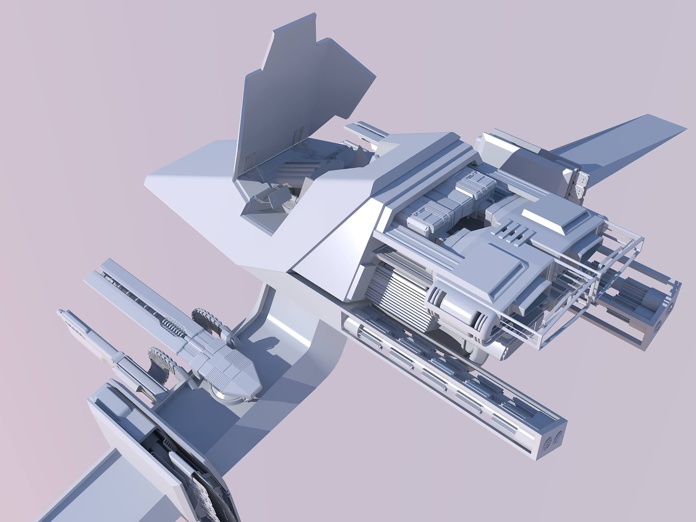
*A spacefighter I meticulously modeled in Sketchup between around 2011 and 2014, rendered with Kerkythea.*

*"Cherry Profile" Mechanical keyboard keycaps with Katakana sublegends, modeled in 3DS Max, then imported into and rendered in Fusion 360.*

This is a very small sample of my work produced prior to 2021; even long after "finishing" these pieces I remain proud of them, but I have many other projects produced since about 2008 and now between Sketchup, 3DS Max, and Fusion 360, of varying scale and scope, including some made in professional settings.

# A Year in Blender 
## Starting Out 
I had wanted to learn Blender since becoming aware of it, but had many false starts, usually due to struggling with the interface and lack of informative tutorials. This has changed over the past few years, Blender has steadily updated and improved its UI, and its ever increasing popularity has led to more high-quality educational content being produced for it. So At the beginning of 2021, I gave it another shot. 

I really began with [Arrimus3D's "Goomba,"](https://www.youtube.com/watch?v=xYUK5HantuE&list=PLxt9ZAGPLIpcuPkSTGOJ9iZssTG3o1a0p&index=4) a fairly simple poly-modeling exercise. This got me familiar with the fundamental controls and workflow in Blender. 

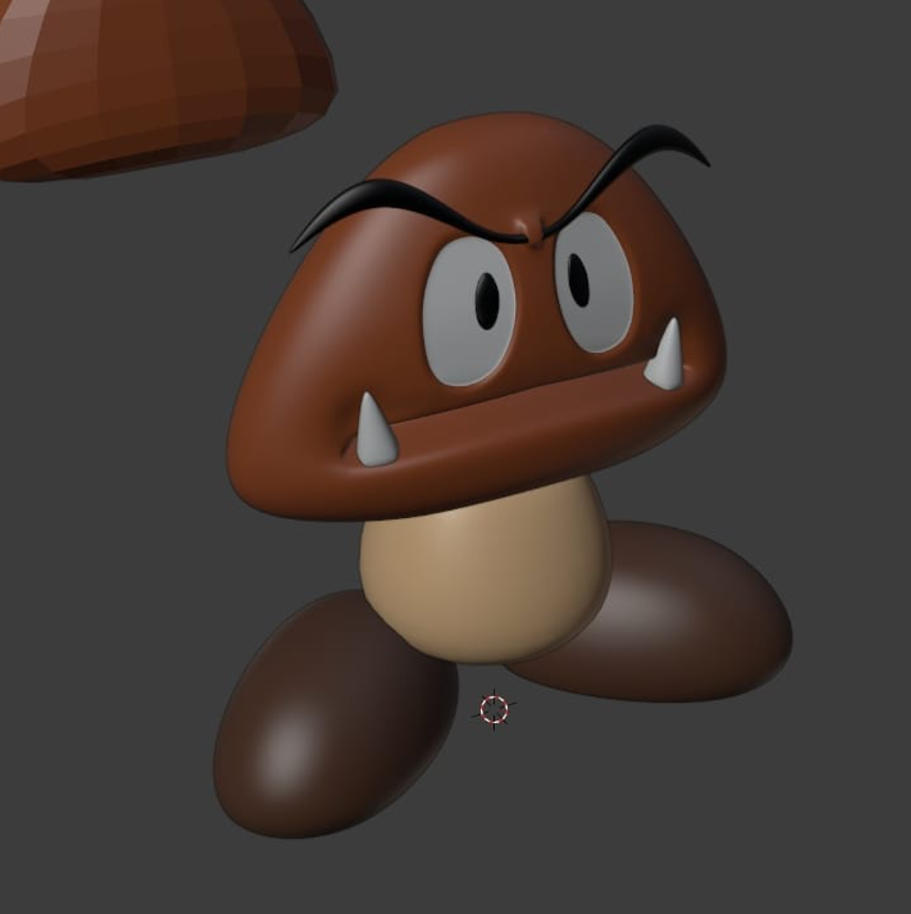

*My first proper model in Blender, a Goomba from Super Mario Bros. Somehow I managed to lose the file for this, so looks like I will need to redo it at some point.*

As a RC Helicopter enthusiast, I was experimenting with modeling the canopy for a [SAB Goblin 380 Buddy](https://goblin-helicopter.com/products/goblin-buddy-380). I attempted this in SolidWorks, which I had picked up a few months earlier, but was struggling so, following the Goomba, decided to try it in Blender. 

This was a relatively difficult exercise in hard-surface modeling, but I really like how it came out. 

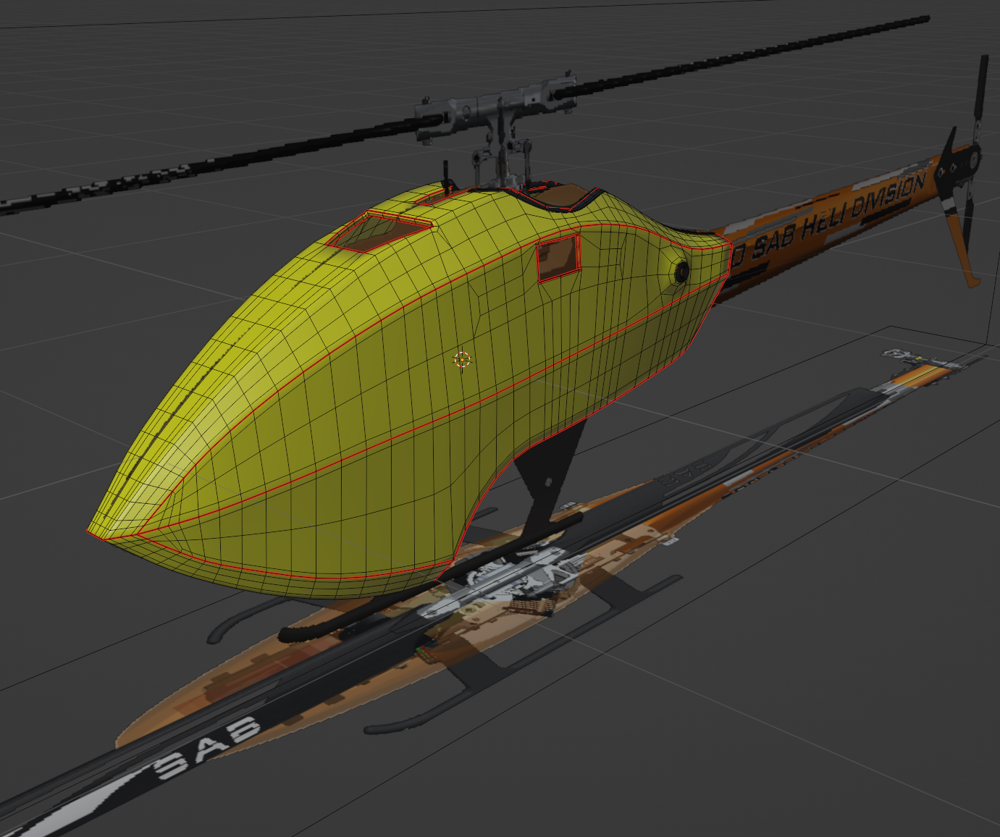

*RC Helicopter Canopy hard-surface exercise, shown in wireframe to demonstrate topology and UV seams.*

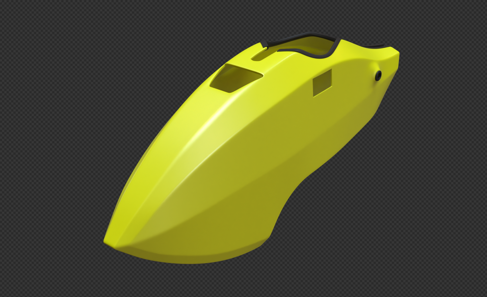

*RC Helicopter Canopy rendered subdivided.*

## The Donut
In search of tutorials, I inevitably stumbled on the famous Blender Guru (Andrew Price) Donut, for [Blender 2.8](https://www.youtube.com/watch?v=TPrnSACiTJ4&list=PLjEaoINr3zgEq0u2MzVgAaHEBt--xLB6U&index=2) at the time. Not finding the torus shape particularly interesting topology, and having just finished the helicopter canopy, I applied the process to that, resulting in the following somewhat unique take on the "donut," which I find quite humorous. 

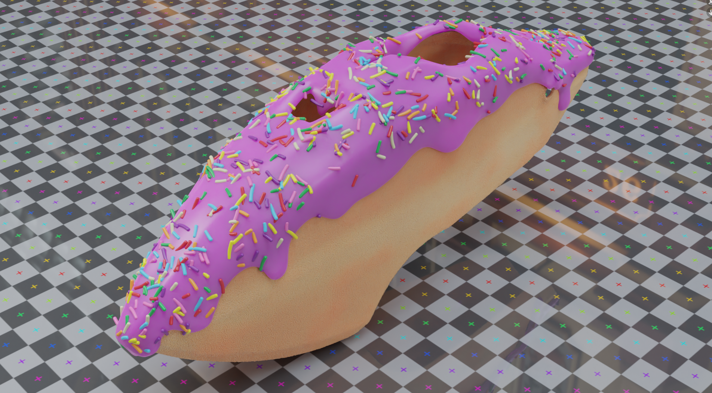

*My take on Blender Guru's donut, applied to the RC helicopter canopy model.*

I look at completing the "donut" like forging my first strong link with Blender, putting me into a position where I felt comfortable enough to begin working on new, larger, more personally-directed projects. 

## Experiments in Texturing and Displacement
Going through Blender Guru's donut tutorial, I was introduced to PBR materials and adaptive displacement. I am absolutely amazed by what you can do with such materials, and spent some time just playing with them. The most interesting project this resulted in was using [topographic maps](https://terrain.party/) to displace a plane and pulling satellite imagery for the same region from Google Earth for the diffuse color to create reasonably realistic background landscapes. 

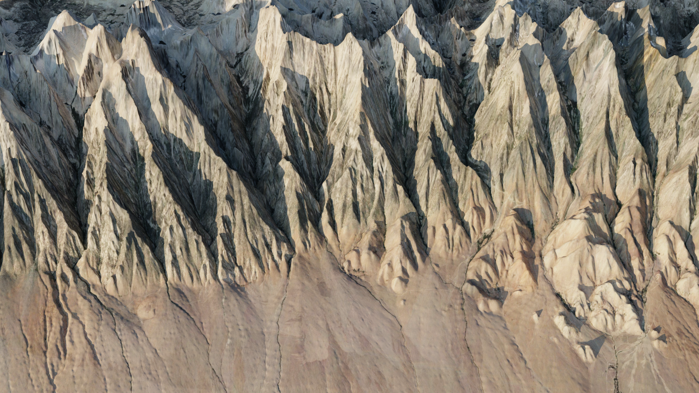

*Terrain from a simple plane using real-world topographic data as a height map and satellite imagery for  color.*

The principle of displacing a plane with topographic data to create terrain is neither mine nor new, but I expanded the idea by figuring out myself how to get the satellite image for the exact same region from Google Earth, which is not something I had seen before. I wrote a tutorial going over the process that can be [read on my github](https://github.com/GeneralPancakeMSTR/PublicNotes/blob/main/height-map-displacement-with-satellite-imagery.md). 

## Keycaps Redux, SolidWorks, and Python
As an obsessive mechanical keyboard enthusiast, one of my previous projects involved modeling and texturing keycaps for creating custom color themes. Though I had already painstakingly worked on this project in 3DS Max and Fusion 360 (see [Early Work](#early-work)), various issues with those programs led me to redo things from scratch early in 2021 with SolidWorks (to model the keycaps) and Blender (for texturing and rendering them). 

Mechanical Keyboard keycaps come in many varying shapes and sizes, but mostly the similarities are enough between them that, for nearly all the unique shapes I needed, I was able to generate them from the same SolidWorks part, provided different parameters. 

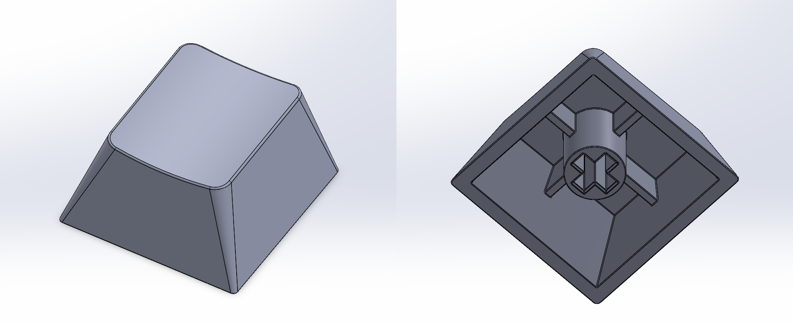

*Two different keycap shapes, "[Row 1](https://deskthority.net/wiki/Keyboard_profile#Cherry) x 1 units" (Top) and "Row 4 x 2 units" (Bottom), generated from the same SolidWorks part file.* 

To get the keycap models into Blender, I exported them from SolidWorks as `.objs` using [this plugin](https://github.com/Aeroanion/Free-Solidworks-OBJ-Exporter). 

To apply the text on the keys, or their *legends*, I exported the models' UV maps (graciously supplied by the exporter plugin) to `.png` files, and aligned the required text over them for each key in Adobe Illustrator

*Legend for the "Q" (with Katakana "Ta," タ) key overlaid on the "Row 2 x 1 units" keycap model's UV map.*

Then, I imported the aligned legend (excluding the UV map) into Blender as an image texture, where I could use its alpha channel to define the color of the legend and keycap independently. 

The problem here is that this process is exactly as tedious as it sounds, especially for around 200 individual keys. Breaking it down to its barest steps, 

- For a given image texture (formatted as Row x Unit x Legend), copy the corresponding base mesh (blank Row x Unit key), and its material. 
- Replace the copy's existing image texture with the current legend image. 
- Repeat for all image textures. 

This is a perfect set of tasks to be programmatically executed, so I wrote a python script (which I do for a living sometimes anyway) to do it. I included a few extra features in the script as well, like automatically loading the blank keycaps/base meshes, and grouping the created keycaps into collections matching the folder structure containing the legend image textures. 

*Blender python script that loads all legend image textures in a folder and creates correctly textured keycaps from them.*

There is another problem, though. Keyboards come in a variety of layouts, and manually positioning every keycap for even one layout is an unreasonable amount of work, let alone doing so for multiple. So I wrote another python script for placing the keys. 

This script determines where the keys need to go from a supplied layout (as a `.json` file), that can be produced by the [keyboard layout editor](http://www.keyboard-layout-editor.com/) website. The idea here being that a user could create their own custom layout, which the python script can use to place the keys accordingly in Blender. 

*Keycaps moved automatically from a semi-arbitrary arrangement into a custom layout using the keycap placement python script (with some keyframing to render the transition smoothly).* 

Notable features of the keycap placement script are 
- Places keys based on a custom layout defined in a `.json` file, which may be generated from the [keyboard layout editor](http://www.keyboard-layout-editor.com/) website. 
- Supports copying keys if the layout includes duplicates, and will use existing copies if it finds them in the scene. 
- Will hide keycaps from the viewport and render if they are not used in the layout. 

and some equally notable limitations, 
- Though the script recognizes a standard and Katakana-sublegended set of keycaps, it does not support completely arbitrary keys or legends, and cannot generate them if they do not exist. 
- Does not support keycap rotation. 

Note that I revisited and iterated on this project for the purposes of this document. Originally, I had included the ability to easily control the color of the keycaps, but that process needs to be reviewed and probably improved. I would also like to add a UI, support for custom legend art ("novelties"), and perhaps package it into a proper addon and release it to the community, but this is work for the future. 

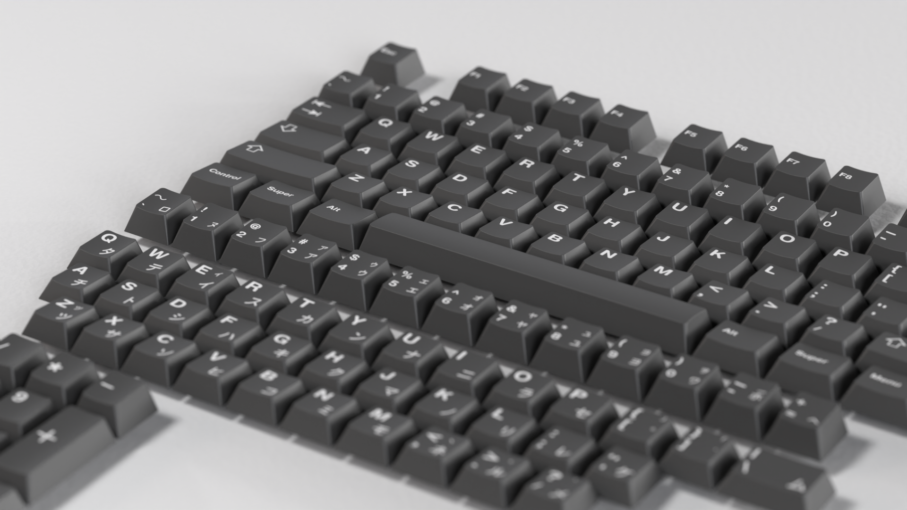

## Sverchok and Phyllotaxis
At some point, I got interested in modelling plants, and in searching for resources came upon [this video](https://www.youtube.com/watch?v=FELFjIw-0d8) by Erindale Woodford, which demonstrates how to generate a daisy-like flower using a python-based, parametric, plugin for Blender called "[Sverchok](https://github.com/nortikin/sverchok)" by arranging petals and seeds on the contours of [Fermat's spiral](https://en.wikipedia.org/wiki/Fermat%27s_spiral) ("[Phyllotaxis](https://en.wikipedia.org/wiki/Phyllotaxis#:~:text=In%20botany%2C%20phyllotaxis%20or%20phyllotaxy,class%20of%20patterns%20in%20nature.)").

Astonished, I reimplemented Phyllotaxis (based on the principles presented in Erindale's video) with Sverchok, and became immediately addicted. Though instead of applying the process to a flower, I applied it to a Yucca, a plant native to my area. 

*A yucca plant, probably [*treculeana*](https://en.wikipedia.org/wiki/Yucca_elata) or [*elata*](https://en.wikipedia.org/wiki/Yucca_elata), with leaves arranged in a Phyllotaxis pattern generated using the Sverchok plugin for Blender.* 

## L-Systems 
What my first version of the Yucca plant lacks (as the viewer may have already noticed) is structure. Bigger Yucca plants grow like trees, not something possible to recreate with my model, which originates all of the leaves from a single, central point. 

Sverchok, however, provides the "Generative Art" node, which is essentially an implementation of [Lindenmayer systems](https://en.wikipedia.org/wiki/L-system) ("L-Systems") that takes `.xml` "rulesets" in place of context free grammars, and may be used to draw [tree-like structures](https://sverchok.readthedocs.io/en/latest/nodes/generators_extended/generative_art.html#multiple-rule-definition-example). 

Even so, I discovered quickly that writing a ruleset for the generative art node that produced anything even remotely tree-like was not easy, and I struggled with it to basically no avail for at least a couple weeks. 

The breakthrough came while studying [Structure Synth](http://structuresynth.sourceforge.net/), the standalone program off of which Sverchok's Generative Art node is based. Structure Synth takes rulesets in "[EisenScript](http://structuresynth.sourceforge.net/reference.php)" format, which I realized could possibly be translated into the `.xml` format used by the Generative Art node. I tried this idea with a simple EisenScript, and it worked, much to my amazement. 

Searching for more EisenScripts to convert, I discovered [Ankur Pawar's website](https://sites.google.com/site/workofap/structure-synth), which references a [beautiful repository of EisenScripts](https://github.com/ankurpawar/StructureSynth) that I could experiment with. 

I was able to convert Ankur Pawar's "[Fractal Tree](https://github.com/ankurpawar/StructureSynth/blob/master/Tree/fractaltree1.png)" ([EisenScript](https://github.com/ankurpawar/StructureSynth/blob/master/Tree/fractaltree1.es))

*Ankur Pawar's "Fractal Tree," converted from Structure Synth "EisenScript" format to Sverchok's Generative Node-readable `.xml`.*

which, with a little modification, particularly of the angle and scale values, can be made to produce this 

*A modification of Ankur Pawar's "Fractal Tree" to produce a tree-like structure in Sverchok using the Generative Art node.*

With a workable structure, what I wanted to do at this point was instance leaves arranged in the Phyllotaxis pattern on each segment (or branch) of the tree. Due to how Sverchok works, the first step of this meant determining the orientation and position of each segment, then using those properties to create and position corresponding transform matrices.

*Transform matrices aligned with each branch of a simplified version of the fractal tree structure. These transform matrices may be used to instance objects or further arrangements of matrices at their position and orientation.*

Though a good start, this setup is only capable of instancing the same assembly of objects on each segment, which is not a great approximation of real plants and trees (e.g., which *usually* do not simply have leaves uniformly spread along their branches, although even that sometimes seems [to be the case](https://hort.extension.wisc.edu/articles/euphorbia-myrsinites/)).

There are a few things I thought would make this more realistic 
- The angle ("bloom") of leaves with respect to the segment they are on changes as they move closer to the tips of the plant. This is particularly so with Yuccas, where the leaves transition from pointing downwards near the root of the tree, to nearly straight up at its tips. 
- Leaves may change color the further they are from the plant's root. Again, this is particularly evident on Yuccas. 
- Leaves are not identical, and should have some random variation, both in surface and shape. 
- Leaves may not grow towards the root of the plant. 

<em>A beautiful example of a Yucca that exemplifies some of the features I wanted to include in my model.</em>

I was able to achieve each of these features, although not quickly or trivially. 

*An early version of my Yucca tree, featuring increasing bloom angle and transitioning color as the leaves get closer to the tips of the plant, and some random variation in leaf shape and material. Textures are procedurally generated.*

Also noteworthy, I switched from hand-modeling the leaves, to using Sverchok to extrude them out of a Bezier curve and applying various random distortions to generate distinct shapes. 

*A node group I wrote in Sverchok for randomly generating Yucca leaves.*

This work led to one of my prouder moments of 2021, which was being given the opportunity to go over my process to an audience of 3D enthusiasts, some of them professionals, over a virtual stream. 

A recreation of this [stream](https://www.youtube.com/watch?v=eq1qc2pnljk) (I failed to record the original with audio) can be found on my youtube channel, along with a [Part 2](https://www.youtube.com/watch?v=dJuDzoXgWuA) that covers some further details. I also have written versions of these videos covering roughly the same material, that may be viewed on my Github ([part 1](https://github.com/GeneralPancakeMSTR/PublicNotes/blob/main/lsystems.md) and [part 2](https://github.com/GeneralPancakeMSTR/PublicNotes/blob/main/lsystems_part2.md)).

## Nodevember
[Nodevember](https://nodevember.io/) is a community driven challenge that occurs in the month of November (surprise) to use procedural techniques to complete artwork from a daily (or in the case of 2021, bi-daily) prompt. I took a break from the Yucca to make a few pieces for this year's (2021) event, two of which I am especially pleased with. Both of these pieces were made largely in Sverchok.

### Nodevember: "Colors"
<video height="400" controls>
    <source src="attachments/portfolio/colors_small.mp4" type=video/mp4>
</video>

*Colors* was submitted as a single piece for *all* of the set of ["Color" prompts](https://nodevember.io/prompts/), which I chose to do knowing that I would struggle to come up with interesting responses for each individual color. 

The color of the spheres is their XYZ coordinates converted to RGB, my attempt to display the meaning of texture coordinates (e.g. UV), which is an important, and confusing, part of procedural texturing. 

In the limit that the number of spheres goes to infinity and their size to zero, ideally this animation would reproduce the default cube with generated coordinates applied. 

*Blender's default cube showing generated texture coordinates.*

*The final state of the Colors animation.*

### Nodevember: "Spherical Harmonics"
<video height="400" controls>      
    <source src="attachments/portfolio/spherical_harmonics_slow.mp4" type=video/mp4>
</video>

This piece was a submission for the Nodevember "Tiny" prompt, and is the first few sets of [spherical harmonics](https://en.wikipedia.org/wiki/Spherical_harmonics), plotted in [polar coordinates with magnitude as radius](https://en.wikipedia.org/wiki/Table_of_spherical_harmonics#Polar_Plots_with_Magnitude_as_Radius). 

The animation was created by setting the radius of points on a sphere to expressions for the harmonics ($Y_l^m(\theta,\psi)$, e.g. [$Y_0^0(\theta,\psi)$](https://en.wikipedia.org/wiki/Table_of_spherical_harmonics#%E2%84%93_=_0)), then mixing between equations to transition between the shapes.

Spherical harmonics are a class of special functions ([literally](https://en.wikipedia.org/wiki/Special_functions)) that solve for the [Hydrogen Atom wavefunction](https://en.wikipedia.org/wiki/Hydrogen_atom#Wavefunction)'s angular component, which I figured fell under the category of "tiny." 

## Returning to the Yucca
Having gotten the leaves working about the way I wanted, the next step for the Yucca from where I left off was giving it a body, or trunk. I had already experimented with relatively simple things, for example instancing cylinders on each segment, or using the skin modifier, but both had issues significant enough that I wanted to explore other approaches. 

*Experiments in constructing a trunk, neither satisfactory (Left: cylinders instanced on each segment; Right: application of the skin modifier).*

What I wanted to try was identifying segment paths through the tree that start at its tips and end at its root, preferably without overlap. Eventually, after some time thinking about it, I came up with the following algorithm

- Sort the endpoint vertex indexes (which I had previously identified) in descending order. 
  - This assumes that vertices with larger indexes are generally further from the root of the tree, and thus their paths from it longer. It follows that if we begin our search with these vertices, we should map the paths approximately in the order of descending length. 
  - Hopefully, this results in our mapping the tree's absolutely longest path, which should add realism to the model by giving it at least one, continuous "trunk" that spans the entire tree. 
- Starting from a tip vertex, move to the line whose **tip** index is the **current** line's **root** index.
  - This avoids taking an invalid path at junctions because only the originating line has the junction's index as its **tip**, where the other segments share it as their **root**.
- Repeat this process until the root of the tree, or any segment that was already covered, is reached.

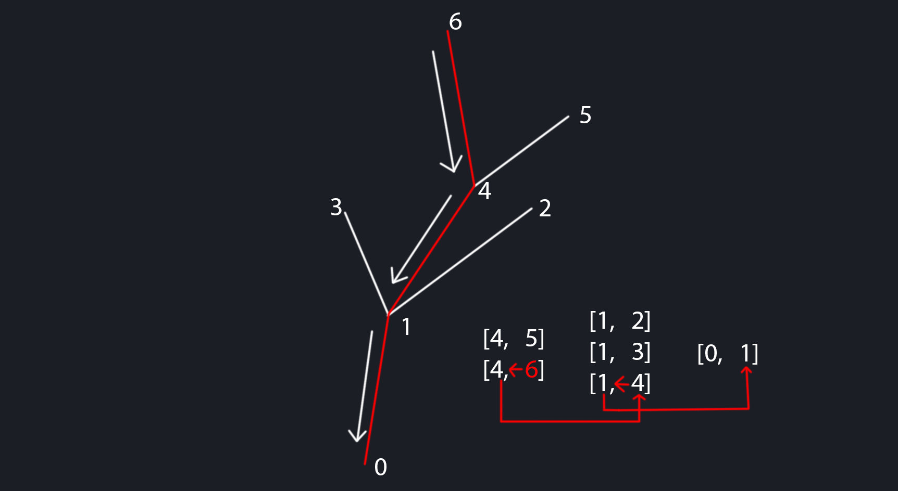

*Diagram of pathfinding by repeating the process of moving to the line whose tip index is the current line's root index.*

Simple though the algorithm might be, this was *not* easy to implement. But, with a *lot* of effort and troubleshooting, I was able to get it working. 

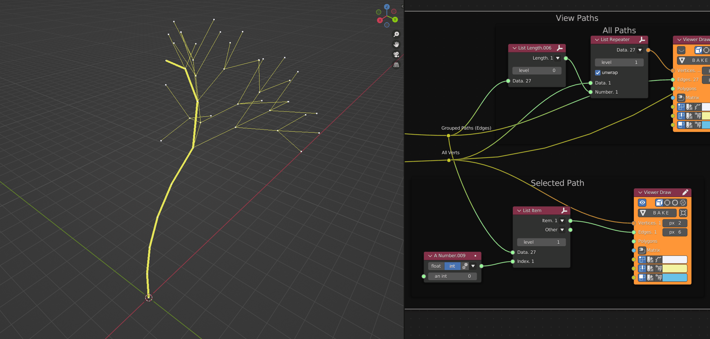

*A few of the tip-to-root paths of the Sverchok tree.*

With the paths identified, I could solidify them by applying a simplified version of the method used by the leaf generator. While solidifying one path is not too hard, doing them all at once was a little tricky.

*"Solidified" Sverchok tree, without redundant paths, which reduces overlapping geometry and improves efficiency* 

On this second pass of the Yucca, along with giving it a trunk, I refined a few things to be simpler or work more how I originally wanted, notably

- Instancing the leaves gradually closer to the tips of their segment as they move towards the endpoints of the tree. I originally had them instancing on the midpoints of their segments, but the tips of the branches poked through the leaves at the tree's endpoints, which I didn't like. 
- Setting the spread of the leaves along their segment exactly to its length, taking into account where the leaves are instanced along it. 

I also spent some time experimenting with and trying to understand the `.xml` rulesets and got a *little* better at generating shapes predictably, improving (maybe) the leaf material, and creating a useable procedural bark texture. 

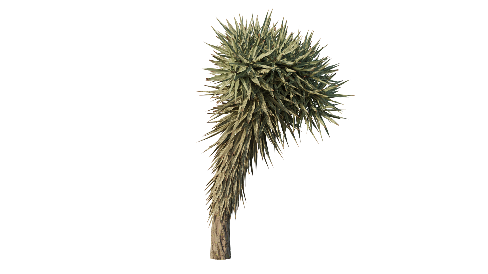

*The most current version of the Yucca tree.* 

This method I developed for creating the Yucca was always meant to be generally applicable to generating plant life, for given parameters, underlying structure, leaves, and so on. 

Though it is effective at producing plants or trees fundamentally different from the Yucca, it needs some attention in the usability department before I would consider it really ready for the community, which is my ultimate goal for it. 

## A Composition 
In one of their videos, [Erindale Woodford](https://www.youtube.com/channel/UCGMyyn2FdEFcDfP1wQRh5lQ) imparted an interesting piece of advice: that one should practice 3D art not just by making assets alone (which is a common "trap"), but by creating a complete composition, much as one might in another discipline, such as photography or painting. After hearing this suggestion, it became a goal of mine to do so, and to include the Yucca in it somehow. 

For better or worse, I came up with this: 

*A completed artwork I made to mark the end of approximately one year working in Blender. Untitled, for the moment.* 

The theme of this piece is that as 3D artists we often and inadvertently create absurd scenarios: a perfect sphere textured in bathroom tile set upon a desert xeriscape, or conversely, perhaps a Yucca plant growing out of a patch of dirt set upon a photo studio backdrop, and so on. 

This is by no means necessarily a unique idea, but I wanted this composite to involve elements that would not feel out of place in other scenes, but put together create something strange, which offers some contrast with other absurdist pieces that I have often seen be quick to dive entirely into the realm of the impossible. 

I wanted this piece to *conceivably* be something an artist could *accidentally* construct, while exploring and testing ideas meant for other works. 

## Procedure
The Yucca was without a doubt the most complicated part in this piece to accomplish, but its major points have already been gone over earlier in this document. 

### The Desk
#

*Close-up of the desk. Modeled in SolidWorks, and textured procedurally in Blender. The woods are Cherry (lighter) and Walnut (darker)* 

The desk is a design I came up with a few years ago that I have the goal of actually building some day, though my amateur woodworking skills may need some improvement yet before I would consider myself capable of executing it well. 

I modelled the desk in SolidWorks, and exported its components as `.obj` files into Blender, much as I did with the [Keycaps](#keycaps-redux-solidworks-and-python). One notable issue I had was that because the desk is made up of multiple parts, any change involved manually re-exporting each piece, which I decided was too cumbersome to do regularly. To resolve this problem, I wrote a SolidWorks script that ran the `.obj` exporter plugin for each visible object in the model (which, in [Microsoft Visual Basic](https://help.solidworks.com/2019/english/api/sldworksapiprogguide/GettingStarted/Visual_Basic_.NET_Standalone_and_Add-in_Applications.htm), was not so easy to get working).

I encountered a similar issue on the Blender side, which has no way of batch-importing `.obj` files. So, to resolve *this* problem, I wrote a tiny Python plugin for Blender that allows one to select a directory and load all of the `.obj` files in it. 

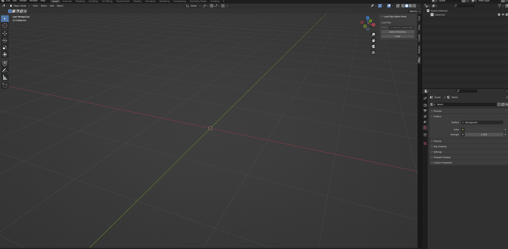

*Simple Python plugin I wrote for Blender that allows one to select a directory and automatically load all of the `.obj` files in it.* 

### The Cardboard Box and Picture Frame
#
The cardboard box and picture frame are both [hard-surface/subdivision](http://wiki.polycount.com/wiki/Subdivision_Surface_Modeling) models, which I took the time to do carefully expressly for the purposes of practice. The cardboard box was textured (mostly) procedurally, with a little manual texture painting for the tape. 
 

*The cardboard surface and inseam materials are both procedural, while the tape was hand-painted onto the box's UV map to control roughness directly.*

*The frame is a basic hard-surface model, textured with very simple procedural materials.*

### Packing Peanuts
# 
The packing peanuts pouring out of the cardboard box I achieved using geometry nodes, one of only a few minor successes I have had using them.

Essentially, the original peanut models (both handmade) are distributed onto what amount to two, separate, parametrically distorted cylinders. 

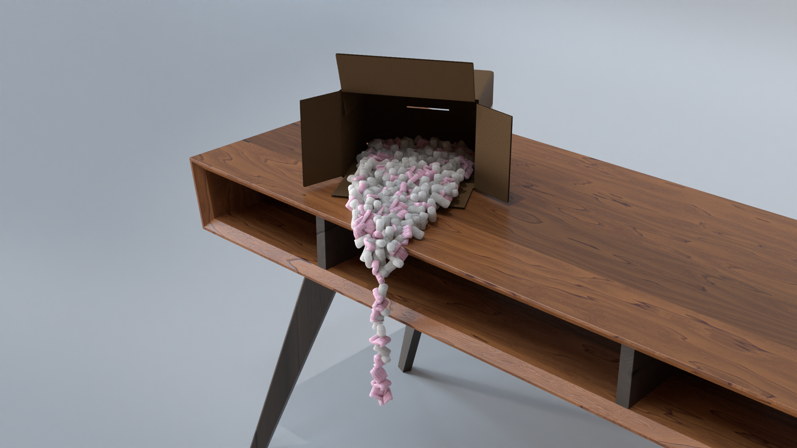

*Packing peanuts, "poured" out of the cardboard box by using geometry nodes to distribute the peanut models onto two different shapes, both also made in geometry nodes. Packing peanuts themselves were hand modeled.*

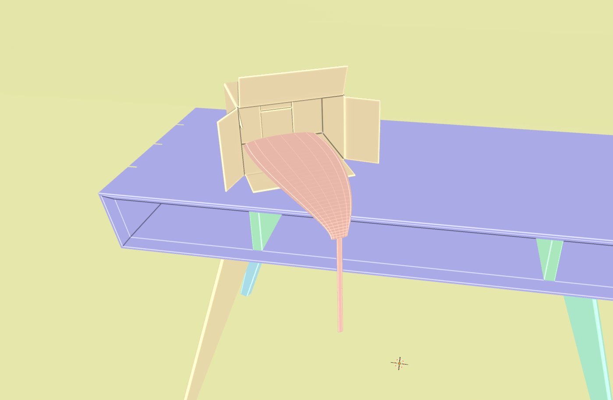

*Highly distorted cylinders (looking very...tongue-like) for instancing the packing peanuts onto.* 

### Dirt Pile 
# 

The ground the Yucca grows out of is nothing more than sculpted planes with two PBR dirt materials applied and mixed using a simplified version of [this un-tiling method](https://www.youtube.com/watch?v=ve3TXCuwoKo&t=156s). The illusion of scattered dirt is achieved by positioning the planes on the boundary of the floor, so that the adaptive displacement geometry just barely pokes through in a random places.

*The pile of dirt, basically sculpted planes with PBR textures applied and adaptive displacement.* 

## Concluding Thoughts 
- Really spending a full year "getting to know" Blender fulfilled a longtime goal of mine (not that I am planning on stopping or anything). 
- I can't believe I hadn't gotten into proceduralism before, nor did I expect to become as obsessed with it as I did. 
- I am further surprised having closed out the year with completed works *and* proud of what I have accomplished.
- Cliché as it is, I am looking forward to another year of surprises and learning, and having no idea what I will get up to next. 
- If you have read up to this point, thank you for your time. You can go now. 