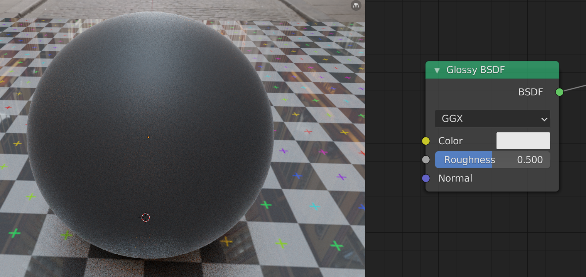
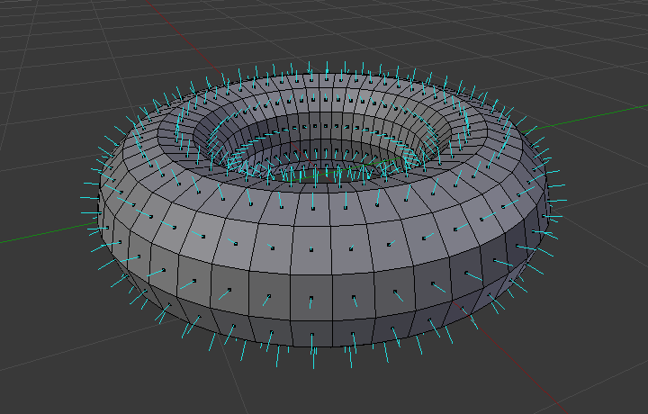
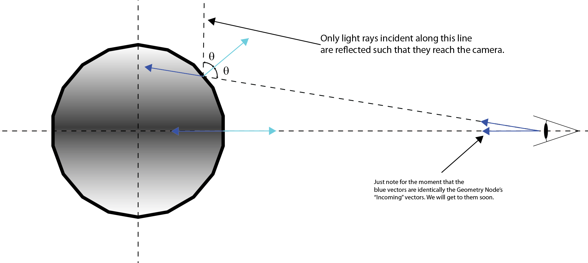
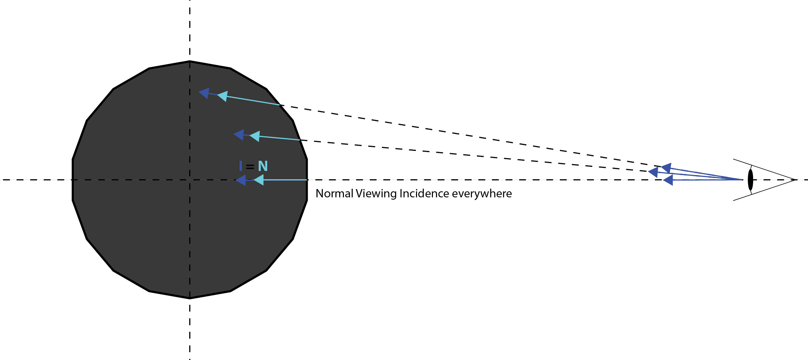
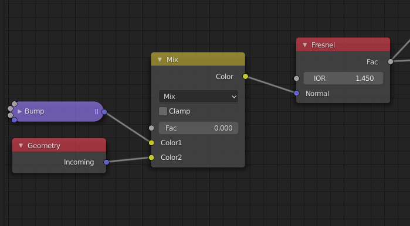

# Understanding PBR Materials
I know there's not any particularly good reason to do this (because it's done, better, elsewhere), but I like the idea of presenting a treatment of PBR materials in blender. 

This is largely based off of Blender Guru's treatment of PBR materials. I just wanted to put it into written form and have the parts annotated. Also understand the process better for myself. 

## Stack Exchange Question 
- [Link](https://physics.stackexchange.com/questions/617579/qualitative-analysis-of-dielectric-interaction-between-dielectrics-and-conductor)

> For some context, I'm trying to understand some of the physics behind "Physically Based Rendering" (PBR) in 3D rendering engines, see for example 
> 
> - [THE PBR GUIDE BY ALLEGORITHMIC - PART 1](https://academy.substance3d.com/courses/the-pbr-guide-part-1)
> - [THE PBR GUIDE BY ALLEGORITHMIC - PART 2](https://academy.substance3d.com/courses/the-pbr-guide-part-2)
> 
> I'm doing this pretty much to satisfy my own curiosity. I do come from a physics background (masters degree in computational physics), but I don't remember too much from E&M, especially when it comes to the interaction of light with matter. 
> In these treatments of PBR materials, they usually start with a dielectric, and attribute it a "diffuse color," meaning just whatever color that object is (be it a texture of rocks, or simply blue or purple). 
> Here's where I'm confused: Often, these PBR discussions note that "dielectric materials do not have colored reflections, they reflect light uniformly across all wavelengths." Yet, if you look up "why do things have color" (or something), the answers is basically (e.g.) "it's blue because it doesn't reflect the red and green light." 
> 
> - **So, how can an insular material simultaneously reflect all wavelengths uniformly, but also be a particular ("diffuse") color, because it only reflects that wavelength?** 
> - **Also, what is the mechanism by which the light that isn't reflected, isn't reflected? Is it by refraction (transmitted into the material at a different velocity) or absorption (converted to energy)?** 
> 
> Then they get to metals/conductors, and wow everyone by saying "Metals have no diffuse! Only reflection! But they can *tint* the reflection!" 
> If I recall correctly, the way metals reflect is really by re-transmitting the incident light. Meaning (very qualitatively), the free electrons oscillate in response to the impingent EM wave (the incident light), creating their own resultant EM field, which is transmitted back out as the object's reflection. The frequency of the resultant EM wave is a property of the conductor's electronic structure, hence: tinted reflections. 
> I know this is a nonsense way of putting it, but it's kinda like the light that is reflected from the surface of a metal isn't the light that hit it, it's a *response* to it. The light that actually struck the material was absorbed and converted into the energy that was then used to create the resultant, reflected, field.
> And because the response of a metal's electrons is so strong, light is *barely* actually transmitted into the material (of order nanometers), hence, for some reason, "no diffuse." 
> So, oddly, I feel like I have a better grasp on how metal interacts with light, than I do for dielectrics, **assuming my qualitative analysis is correct.... is it?**

- It may be that dielectrics *do* have tinted reflections, but our brain sort of corrects for them? 
- -> c.f. Difference between shining white light on a dielectric, and colored light on one. Brain can get easily confused. 

## Resources
- [Blender Guru's PBR Dielectrics](https://www.youtube.com/watch?v=V3wghbZ-Vh4&list=PLjEaoINr3zgFq73es7U21vOXk_wcn3eMg&index=2&ab_channel=BlenderGuru)
- [Blender Guru's PBR Metals](https://www.youtube.com/watch?v=m1PkSViBi-M&t=1456s&ab_channel=BlenderGuru) 
- [PBR Encyclopedia](https://docs.google.com/document/d/1Fb9_KgCo0noxROKN4iT8ntTbx913e-t4Wc2nMRWPzNk/edit) 
- [CynicatPro's Blender Physically Based Shading](https://www.youtube.com/watch?v=xMpDTk3DTW8&list=PLlH00768JwqG4__RRtKACofTztc0Owys8&ab_channel=CynicatPro)
- [THE PBR GUIDE BY ALLEGORITHMIC - PART 1](https://academy.substance3d.com/courses/the-pbr-guide-part-1)
- [THE PBR GUIDE BY ALLEGORITHMIC - PART 2](https://academy.substance3d.com/courses/the-pbr-guide-part-2)
- [CG Bookcase: How to Use PBR Textures in Blender](https://www.cgbookcase.com/textures/how-to-use-pbr-textures-in-blender) (Leaves in particular, plus Ambient Occlusion)
- [Using CC0 Textures in Blender](https://www.notion.so/Using-CC0-Textures-in-Blender-cd901f88976f4338882beb393aad11e5)
  - Really useful actually
- [UCSD Fresnel Surfaces](https://cseweb.ucsd.edu/classes/sp17/cse168-a/CSE168_03_Fresnel.pdf)
  - A little discussion on the way light interacts with Dielectrics vs. Metallics. Might be worth looking at the rest of the course. 
- [Reflection/Refraction](https://www.waves.utoronto.ca/prof/svhum/ece422/notes/17-reflrefr.pdf)
  - Notes from a textbook. Very mathy, but has diagrams I haven't seen elsewhere. 
- [Background: Physics and Math of Shading](https://blog.selfshadow.com/publications/s2013-shading-course/hoffman/s2013_pbs_physics_math_slides.pdf)
  - Possibly Interesting?

- [ ] What the *hell* is diffuse? How do dielectric materials have color? How can they reflect light uniformly at all wavelengths (hence not have tinted reflections), but also be blue or yellow or black or whatever (because they absorb/refract (which one?) whatever colors)? 
  - [Stack Exchange Question](https://physics.stackexchange.com/questions/426729/how-does-light-actually-interact-with-different-materials-pbr)

## Energy Conservation
Actually, PBR discussions usually start with the concept of energy conservation. 

## The PBR Dielectric 
We will start, as usual, by implementing a PBR dielectric material, and present the concepts and techniques necessary to do so within this context.  Fortunately, though, much of the approach carries directly over to the implementation of the PBR metallic, making it relatively quick and, hopefully, understandable.
> ### Optional: Dielectric vs. Metallic
>Dielectrics, also known as electrical insulators, do not conduct electricity, meaning they do not readily permit the flow of electrons (current). Qualitatively, this is because the electrons in the material are tightly bound in chemical bonds, from which it takes a large amount of energy (read: voltage) to break them out of. Hence the adage "everything is a conductor for a great enough voltage." 
>
>Metallic materials, on the other hand, are so because they *do* readily conduct electricity, for exactly the reason that insulators do not: because the electrons in the material are *not* chemically bound, and thus free to "move about." 
>
>There are a million analogies for this, and I'm not particularly convinced that I could come up with one better than the [alternatives](https://www.youtube.com/watch?v=-Rb9guSEeVE&ab_channel=PhysicsVideosbyEugeneKhutoryansky), so perhaps I will just leave it at that, for the time being. 
>
>But what does this have to do with light? Because light, itself an electromagnetic field, interacts with the material's electromagnetic field, which is a product of its electronic properties (I desperately *want* to say that electromagnetic fields only interact with other electromagnetic fields, but that's just not true - e.g. light interacts with gravitational fields). 
>
>Of course, that says absolutely *nothing* about *how* light interacts with either of these materials (just that it *does*), and this discussion is not going to change that, because it would mean the shift from being qualitative to quantitative, which gets really complicated, really quickly. Instead, we will simply present the resultant physics, with qualitative analysis as appropriate. 

## Fresnel 
PBR always starts with the concept of "Fresnel" (no it doesn't ^), meaning the physical [transmittivity/reflectivity](https://en.wikipedia.org/wiki/Fresnel_equations) properties of a material. The summary is that light is reflected from a material's surface as a function of incident angle (and index of refraction),

> $R \equiv R(\theta,n)$ 

 such that the smaller the angle, the more light is reflected, to the effect that surfaces appear more reflective when viewed edge-on, than dead-on. 

What is viewing angle? I would define it as the angle between the direction your eye is pointing and a surface normal. Edge-on would be perpendicular, and dead-on would be parallel: 
        
        <0 → ↤ : Dead-On
        <0 → ↥ : Edge-On

Luckily, Blender actually has a Fresnel node, which maps the reflectivity falloff by angle physically accurately (I'm not sure if it's exact or an approximation):

For a dielectric material, the idea is that we will use the Fresnel node to define the mix between a Diffuse and Glossy shader

Compare this with the results of manually adjusting the mix shader's factor

## Roughness
It turns out that the Fresnel effect is supposed to decrease with roughness, and while we can still adjust roughness using the Glossy shader's control, it does not account for this relationship. The effect is that, as the Glossy node's roughness is increased for constant Fresnel, the object's edges become more reflective than they actually should be, and look brighter as a result: 

> ### Optional: Glossiness, Roughness, and their effect on Fresnel
>> **This should be edited and integrated into this section somehow (Put this somewhere):**
>> - Fresnel is, like, a combination of a material and system property, in that it requires a boundary (two or more refractive indices) to exist. To me, it begs the question: "Why do *all* materials exhibit Fresnel? Even metal?" I guess it's because, even if we are looking at an object that is truly one perfectly smooth material, its surface is still making a boundary with the surrounding environment, be it air, water, vacuum, or otherwise. Nonetheless, I definitely still don't understand why metals exhibit Fresnel. 
>>       The only time there wouldn't be a Fresnel effect would be if the indices of refraction of the material and its boundary were equal, which is the same as looking at the material from inside of it. You do this all the time, I think, looking through air, which I guess doesn't exhibit Fresnel, so, yeah...?
>> - The phrase "Refractive interface" sounds nice. 
>> - Acknowledge that this is confusing, and that we are rapidly reaching the limitations of what a qualitative discussion can explain. I.e., if we want to understand this better, we need to start getting into the physics, of which there would be a significant amount to cover to get back to this point. 
>> - I still don't really understand (or, more likely, remember), even  at a qualitative level really, the mechanism by which dielectric materials interact with light. 
>
> This section is on making the physical justification for why the Fresnel effect is diminished as surface roughness increases, and the distinction between *roughness* and *glossiness*.  
>
> Qualitatively, my impression is that uniform surface roughness uniformly reduces the amount of light reflected in a particular direction, regardless of incident angle. It follows that it has a uniform effect on Fresnel, such that the effect is subdued everywhere by the same amount, regardless of viewing angle.
>
> Basically, if Fresnel defines reflectivity according to $R=R(\theta,n)$, roughness becomes a modulating coefficient (e.g. $\alpha$) on $R$, i.e.
> 
>> $R \equiv \alpha R(\theta,n)$
>
>> What exactly is roughness, though, and how is it distinct from glossiness, aka specularity, or how reflective a material is? 
>> I drew up a quick interpretation on paper, it should go into this document, but until then take this as a basic explanation.
>> Essentially, any given material, in the case of perfect smoothness, will absorb a certain amount of light, and reflect a certain amount of light, as a function of incident angle and the material's properties (Fresnel). This defines the material's **glossiness**, or, equivalently, its **specularity**. To deliberately belabor the point, **glossiness is a material property**.
>
>> Roughness, on the other hand, is some (probably statistical) specification of a **particular object's** surface's **deviation from perfect smoothness**. It might more aptly be referred to as "scatter," for there is no guarantee that parallel rays will reflect in parallel, but rather **scatter**, if they do not strike the same point on the object's surface. The is converse to the case of a perfectly flat, smooth surface, for which parallel incident rays will reflect in parallel (hence, mirroring an incoming image), regardless of where they strike. 
>> This is just a guess, but maybe they compute roughness as a ray's incoming angle randomly modulated within some range, up to, idk, 90 degrees? Or something?  Such that if we let $\theta_I$ be a ray's incident angle with respect to a surface's normal, and $\theta_R$ the angle at which it reflects, then 
>> $$
>> \theta_R = \rho \theta_I 
>> $$
>> I mean, this is a super rough (oops) definition, I need to think about it more to refine it. 
>> At any rate, roughness is approximated as a uniform effect over the surface of a material. **My impression** is that it doesn't actually interact with the Fresnel effect directly, but with the object's overall reflectivity, which Fresnel is a function of. 
>
>> Okay, so all that qualitative analysis out of the way, the most important takeaway is that **a material's appearance is the sum total of its specularity (material specific) *and* roughness (object specific) properties.**
>
>> One other thing we should note, and possibly (probably?) discuss, is that light can actually be captured by certain surface irregularities (e.g. overhangs), effecting an actual dimming effect, on top of everything else. 

### The Geometry Node 
Our goal is to form a relationship between the Glossy node's roughness slider and the Fresnel effect that approximates reality. Since roughness uniformly diminishes Fresnel everywhere, all we really need to do is mix Fresnel *out* of the resultant shader as roughness increases. But to accomplish that, we need to find a way to block the Fresnel effect. 

We will do this in a borderline incomprehensible way, that makes absolutely no sense just by "looking at it," but I think we go this route because it's a more robust method than just a brute-force masking out of the Fresnel effect, or something. Honestly, I'm not entirely sure. Anyway,

Enter the Geometry node.

The only part of the Geometry node we will be using is its `Incoming` property. So, let's take some time to understand it.

> Fundamentally, the output of the Geometry Node's `Incoming` field is the vector $\bold{I}$ (as an RGB color) pointing from the viewing origin to a point on the object's surface.

Because I'm not very good at translating color values to directional arrows, and trying to comprehend [the manual's cryptic definition](https://docs.blender.org/manual/en/latest/render/shader_nodes/input/geometry.html) was testing my sanity, I spent some time flailing the camera around wildly in Blender until I eventually come up with the below illustrations; I hope they help explain why the `Incoming` field makes the colors on the sphere behave how they do.  

Here are a couple resources I found at least slightly helpful figuring out what was going on (damned near impossible to find information about the goddamned thing): 
- https://blender.stackexchange.com/questions/130073/how-to-interpret-output-position-values-of-geometry-node
- https://blender.stackexchange.com/questions/130769/how-to-make-simple-fresnel-in-blender-open-shading-language

To understand how the `Incoming` field can be used to quash the Fresnel effect, we need to understand a little bit about how the Fresnel node itself works, in particular what that `Normal` input is about

First, let's answer the question "what *are* normals?"
> An object's surface normals are the unit vectors perpendicular to the planes defined by the polygons from which it is comprised (teal lines in the below picture).

Hopefully this picture from the Blender manual conveys the idea, but we are going to need to get a little more nitty gritty, so here are a few normals on our 2D demonstration sphere 

Now, the only light rays that "matter" to the Fresnel node are those that actually reach the camera (I'd bet this is generally true for much of the way stuff is rendered in Blender). 
- That is, we are only concerned with the rays that are reflected along the path between the point they strike and the view origin. This path makes some angle with the normal vector at that point, and we can compute it provided the normal and the camera's position. 
- By the law of reflection, the *incident* angle of these rays must be the same as their angle of reflection.
- Thus, we know the angle at which light must strike the object's surface to reach the camera, and can compute the Fresnel effect everywhere for only those rays. 

Okay, so we have established that, in Blender, the Fresnel effect is computed as a function of camera position/view origin. How come it looks the same on the sphere, then, viewed from any angle? 

Well, basically, because that's how [spheres do](https://i.kym-cdn.com/photos/images/newsfeed/000/732/409/25c.jpg). The Fresnel effect isn't actually static on the sphere, it just appears that way, because spheres are so symmetric. I'm sure it's pretty easy to show/prove why the Fresnel effect looks the same from any angle on a sphere, but for the moment I'm not going to do that. 

Instead, to show that the Fresnel effect is not static, I'm going to use a counterexample, a plane, for which the effect appears different depending on viewing angle.

Try it yourself! Interestingly, the Fresnel effect viewed alone on the plane gives it what appears to be a reflective sheen...

Alright, back to the Geometry node. Remember, the goal here is to find a way to suppress the Fresnel effect:
> It turns out the accepted way of suppressing the Fresnel effect is to "trick" the node into computing the effect on an object as though it's everywhere viewing its surface "straight-on" (normal viewing incidence). This is achieved by passing the Geometry Node's `Incoming` output into the Fresnel node's `Normal` input, setting the two equal.

The result looks like this 

In the image above, the sphere and plane on the left (closest to the camera) show the Fresnel node with nothing connected to its `Normal` input, while those on the right show it with the Geometry node's `Incoming` property connected to it. The single value this results in for the right-side objects is identically that at the center of the left-side sphere - the only place where it is *actually* viewed straight-on.

How does this work? Well if we look at our 2D illustration again, we can identify the conditions under which normal viewing incidence occurs, specifically when the Incoming $\bold{I}$ vector is the opposite of the Normal vector $\bold{N}$ at a given position, i.e. $\bold{N} = -\bold{I}$: 

Passing the `Incoming` output into the Fresnel's `Normal` input sets all of the object's normal vectors equal to its incoming vectors ($\bold{N} = \bold{I}$), effecting the normal incidence condition *everywhere*. 

> Side Note: strictly speaking, doing this makes the Fresnel node act as though it's looking at the backside of the surface, not the front. But the effect is symmetric, i.e. the back and the front are the same. I'm handwaving this away a little bit. 

This is confusing, in my opinion at least, because it's obviously completely geometrically incorrect (hence, I suppose, why this implementation is referred to as "tricking" or "fooling" the Fresnel node). Geometrically, it would be as though (the backsides) of all the object's surface patches were oriented directly at the camera, something like this (I'm only drawing patches oriented towards the camera at a few points on the sphere cause this drawing is a pain in the ass to make): 

 

 By mixing the Geometry node's `Incoming` field with the Fresnel Node's `Normal` input, we can achieve essentially an *adjustable* Fresnel effect (ignore the Bump node, it's a Blender trick and irrelevant to this discussion)

 

Here it is in action: 
 

Finally, to create the relationship we are after between the material's roughness and its Fresnel, such that one diminishes as the other increases, all we have to do is use a slider to control both the Geometry node's `Incoming` mix and the glossy node's roughness:

> Note that Blender appears to lack a "slider" node, and I'm not ready to start grouping things yet (perhaps contrary to popular opinion, I actually feel doing so complicates things, rather than simplifies them), so I created my own "slider" node group from the `Map Range` node, which seems to have done the trick: 

Breathe a sigh of relief, because the hard part is *done*. The remainder of the discussion, including through the implementation of metallic materials, is essentially mechanical, basically relying on principles and techniques established in the preceding sections.

## Reflection 
Earlier, we handed the [Fresnel node](#Fresnel) complete control over the mix between the material's diffuse and glossy properties, thereby fixing its intrinsic (i.e. independent of roughness) reflectivity. At this point, [Andrew Price/Blender Guru](https://youtu.be/V3wghbZ-Vh4?list=PLjEaoINr3zgFq73es7U21vOXk_wcn3eMg&t=2102) would introduce a control, in the form of a `MixRGB` node, that gives the user control over how much white is mixed into the Fresnel node's output, enabling adjustment over its mimimum reflectivity value (value at normal incidence, $F_0$), and by extension of the material's overall reflective qualities.

I believe that this control has no basis in reality, and was put there by Mr. Price to give the artist back some control over the material, so that they may fine-tune it to their tastes. I came to this conclusion after having spent *some time* attempting to make a physical justification for it, with limited success.  

The thing is, the minimum reflectivity of dielectric materials simply does not really extend outside of the [2-5%](https://academy.substance3d.com/courses/the-pbr-guide-part-1) range. By *forcing* the value outside this range, one is basically making the material decreasingly a dielectric and increasingly a metallic. This is pretty obvious looking at the resultant shader output 

So, for the time being, I am going to omit this addition, and leave the Fresnel node with total control over the Glossy/Diffuse mix. However, if I really wanted to add an adjustment to a dielectric material's reflectivity, on top of Fresnel, I would do it over a *very* small range *about* the Fresnel minimum (i.e. on both sides of it, by mixing both light and dark into the node's output). I might start [here](https://blender.stackexchange.com/questions/73009/how-to-make-a-node-group-to-calculate-fresnel-via-f0-values), for example. 

## Roughness Correction 
This is really hard to find information on, but basically, there are older Blender shaders that are non-linear in some of their parameters, for example the Glossy node in its roughness, for some reason. This is important because it seems to be non-standard in the industry, so roughness maps passed into the Glossy node may not display properly, if they are expecting the standard, linear scale. 

> Fortunately, the solution is trivial: any shader that operates on a non-linear scale may be reasonably linearized simply by squaring its input. 

And we do just that for our dielectric's roughness control, by inputting it into a "Power node" - a math node that performs its `Power` operation for an exponent of 2 on its input: 

This should help correct our glossy node's roughness scale, and help it respond more appropriately to roughness maps. The effect is surprisingly noticeable, compare below on the left without the power node, to the right with it:

> Some comments: 
> - At first, I thought adding the Power node was just about giving the user a broader roughness range to operate on, kind of like a Vernier scale. I didn't realize it actually affects how the roughness map is displayed until I started trying to figure out how the Power node trick works. The realization just sort of struck me all of a sudden while researching the problem. 
> - I *think* I understand why squaring the node's input to linearize it works, but maybe I'm missing a different trivial mathematical solution, or it's just genuinely non-obvious. Regardless, I'm definitely having trouble explaining it. I think maybe $f(x) = x^2$ is linear in $x^2$, basically by definition. It's not linear in $x$! But it is in $x^2$! Because it's literally proportional to $x^2$! I just can't figure out how to write it down or explain it in a non-tautological way. But anyway, I think that's what's going on here, it's like plotting $x^2$ vs. $x^2$.
> - The only thing I know for certain is that the [Principled BSDF shader does not have this problem](https://blender.stackexchange.com/a/98795), while the Glossy shader does. Outside of those two, your guess is as good as mine. 
> - Does it make sense to pass the squared roughness into the Geometry-Incoming mix, to keep the roughness control between the glossy shader and the Fresnel effect consistent? I... guess so? But I don't know? 
> - I'm not sure if these nodes, again e.g. the Glossy node in its roughness, are exactly or approximately parabolic in their parameters. 
> - These are a few resources I found
>       - [Stack Exchange 1](https://blender.stackexchange.com/questions/93790/is-the-roughness-setting-is-based-on-a-standard-measuring-unit)
>       - [Stack Exchange 2](https://blender.stackexchange.com/questions/40586/what-do-glossy-distribution-models-do/41195#41195)
>       - [REALLIFEPUDDING](https://tastypudding.wordpress.com/2014/12/19/simple-pbr-shader-for-blender-2-72-cycles/)

## Finishing Touches and Grouping
We are pretty much done with our PBR dielectric at this point, but there are a few little details we can add that improve the overall setup. 

The first is a single Normal Map that feeds the Fresnel (via the bump node), diffuse, and glossy nodes

This way, we only have to connect a texture's normal map to one place. 

Next is ambient occlusion, which is optional, but so simple to implement there's no reason not to. Just add a MixRGB node set to multiply (to create a "Multiply node"), and pass its output to the Diffuse node's `Color` input. With this arrangement, the texture's color and ambient occlusion (AO) maps are input into the Multiply node's `Color 1` and `Color 2` inputs, respectively. 

The node setup for our PBR dielectric now looks something like this, 

All things considered, it's not too bad, but it is a little cryptic. I think that between creating a group from this arrangement with sensibly named inputs, and renaming some of the nodes, we can start to improve how intelligible the setup is. 

I'm going to do this my way as an example, but I feel that this stage is highly personal, and that you, the reader, should create the node group your way.

First off, I'm going to create the group from these elements: 

Here is what I came up with, the "PBR Diffuse" shader, after renaming the group inputs and a few of the nodes:

And why PBR *diffuse* instead of PBR *dielectric*? Because dielectrics include things like glass, wax, polycarbonate, etc. - basically materials the exhibit transparency and/or subsurface scattering. But I don't see an easy or obvious way to add these properties without replacing the diffuse node altogether, at least not at my skill level. 

> Although I do wonder about creating a dielectric group that substituted a *shader input* for the diffuse node, but how would you connect the normal map up? And what other pitfalls might you run into? Something to play with. 

## The PBR Metallic 
The PBR metallic is basically a simpler version of the dielectric, the key characteristics of which being 
- No diffuse, 100% reflection. 
- 

## It's all pointless 
Because Blender's Principled BSDF apparently has Fresnel built in. I think there's actually no reason to do it this way, this technique is outdated. 

Such as it goes. 

